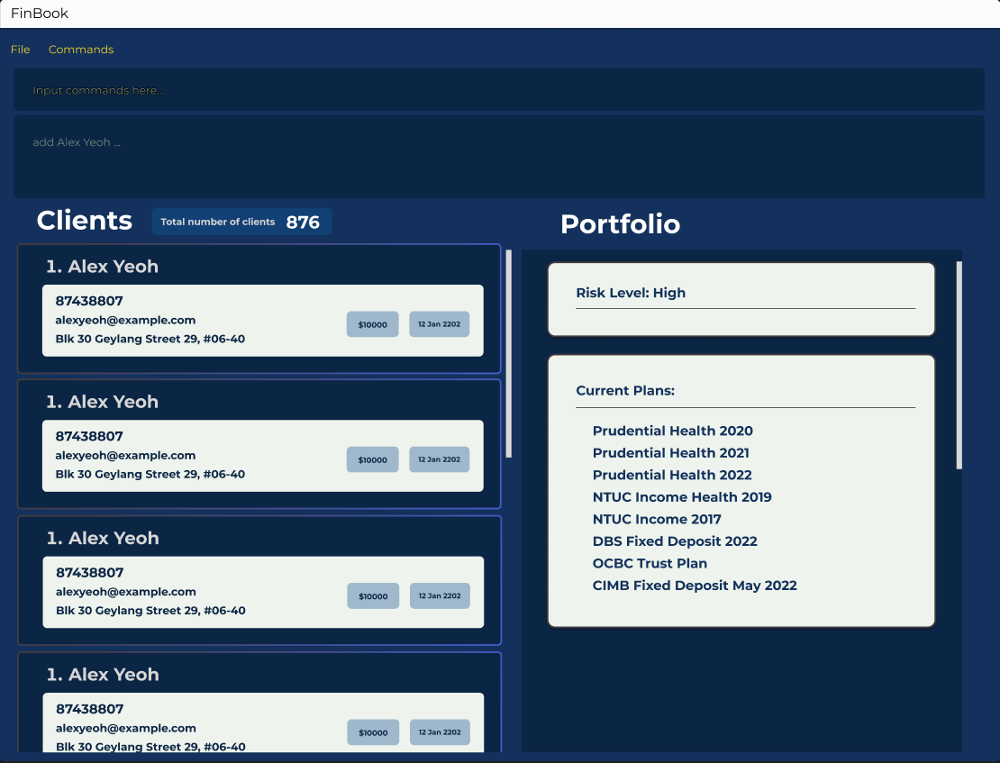

# FinBook

FinBook is a desktop app for managing clients, optimized for use via a Command Line Interface (CLI) while still having
the benefits of a Graphical User Interface (GUI). If you can type fast, FinBook can get your contact management tasks
done faster and more securely than traditional GUI apps.

---

This project is based on the AddressBook-Level3 project created by the [SE-EDU initiative](https://se-education.org).
