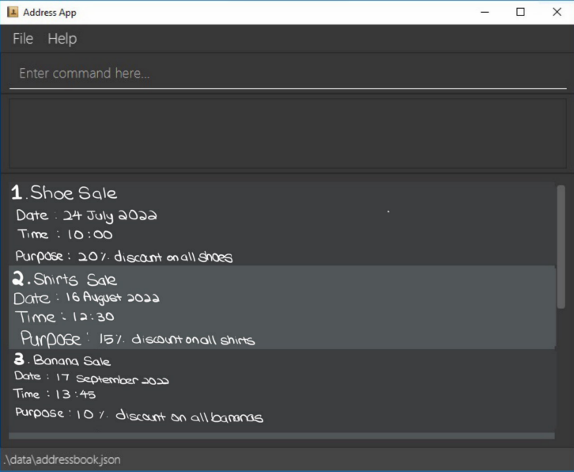

### Persons

### Events

# Duke The Market

Duke The Market is a one-stop marketing tool that allows department stores to keep track of their upcoming marketing plan roll outs, monitor its impact, and to target the appropriate subsegment of its customer base for each of those plans.

* If you are keen on using this application, head over to the User Guide [Link TBC]
* If you are keen on adding new features to this application, head over to the Developer Guide [Link TBC]

This project is based on the AddressBook-Level3 project created by the [SE-EDU initiative](https://se-education.org).
