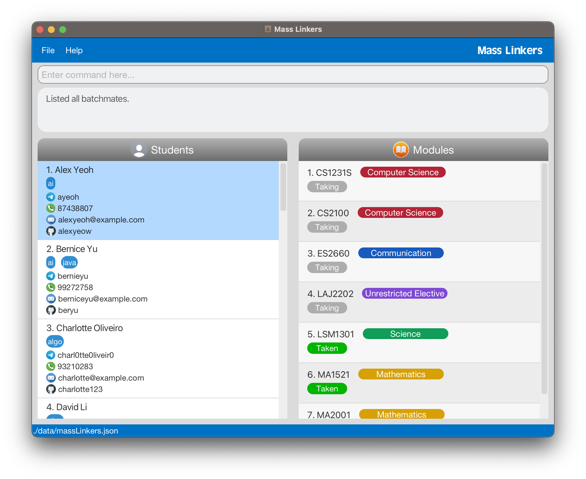

* The project simulates an ongoing software project for a desktop application (called _SETA_) used for managing student and tutorial details.

* It is named `SETA`, which stands for Software Engineering Teaching Assistants, because our application is meant for CS2103T TAs to use.

* For the detailed documentation of this project, see:

  * [User Guide](docs/UserGuide.md)
  * [Developer Guide](docs/DeveloperGuide.md)
  * [About Us](docs/AboutUs.md)

This project is based on the AddressBook-Level3 project created by the [SE-EDU initiative](https://se-education.org)
