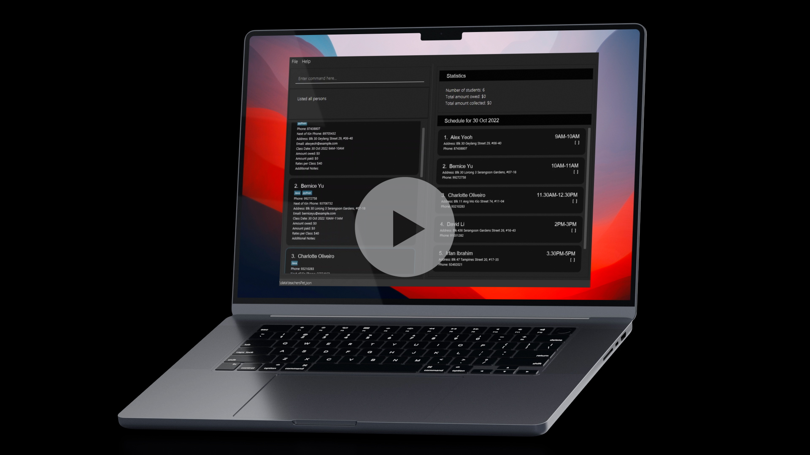

* Teacher’s Pet is a desktop application for managing contacts of students and classes, optimised for use via a Command
Line Interface (CLI) while still having the benefits of a Graphical User Interface (GUI). If you can type fast, Teacher’s
Pet can get your contact and class management tasks done faster than traditional GUI apps.
* It is named `Teacher's Pet` (`TP` for short) because it was designed to assist teachers.
* For the detailed documentation of this project, see the **[Teacher's Pet Product Website](https://ay2223s1-cs2103t-t09-4.github.io/tp/)**.
* This project is a **part of the se-education.org** initiative. If you would like to contribute code to this project, see [se-education.org](https://se-education.org#https://se-education.org/#contributing) for more info.
* This project is based on the AddressBook-Level3 project created by the [SE-EDU initiative](https://se-education.org).
