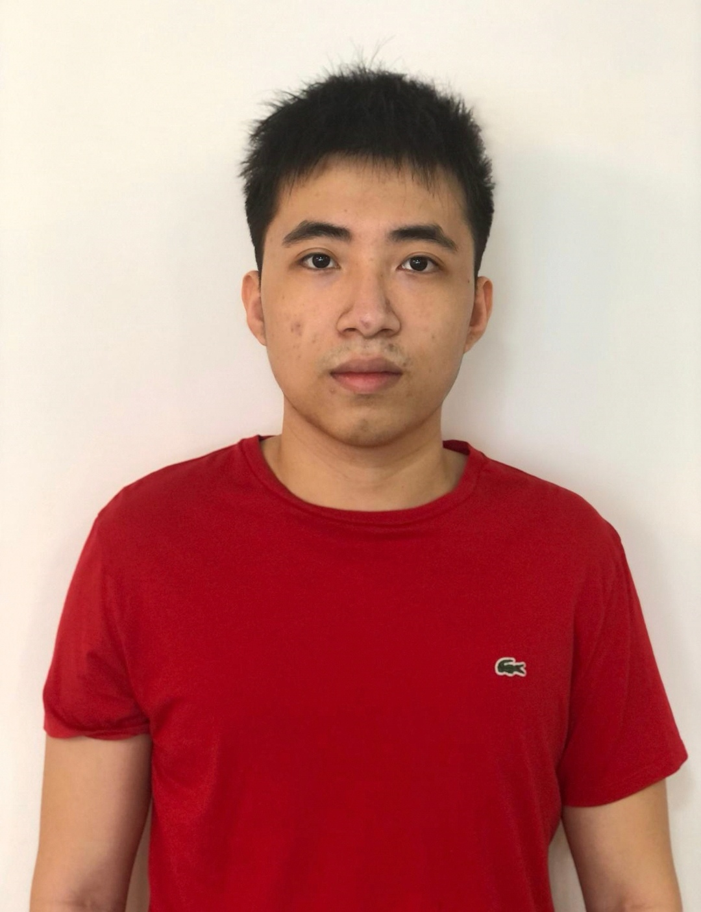
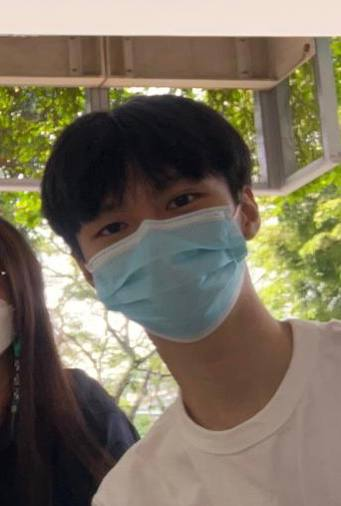
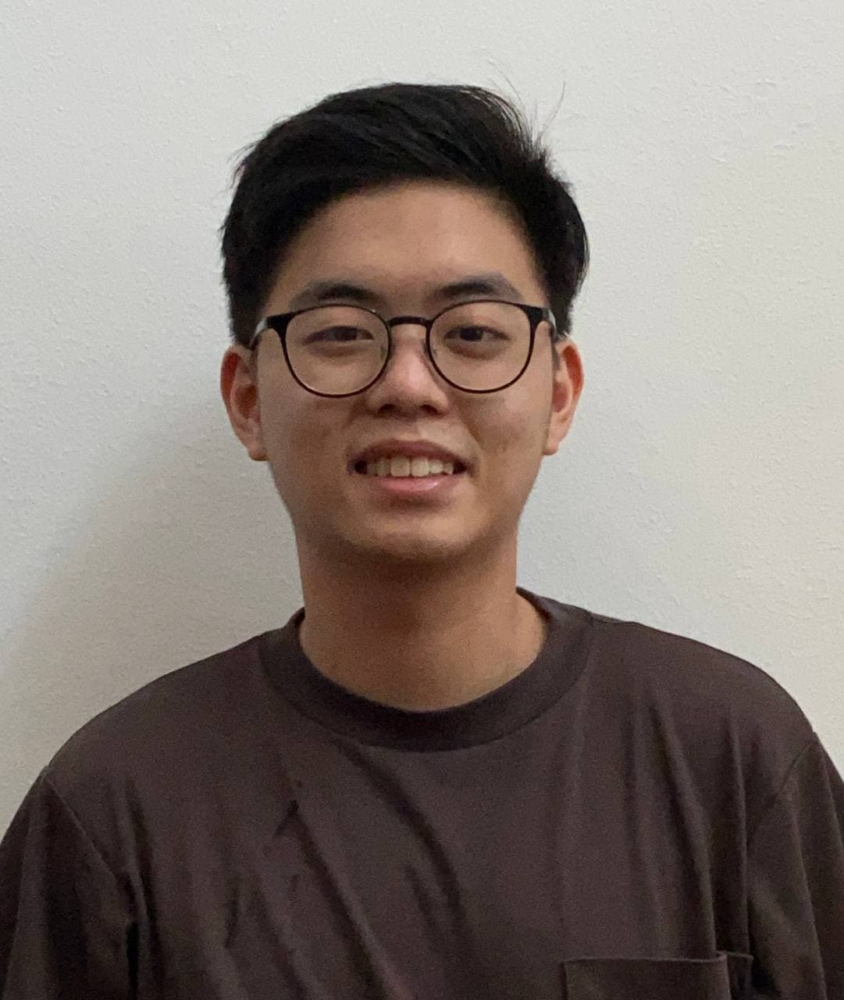
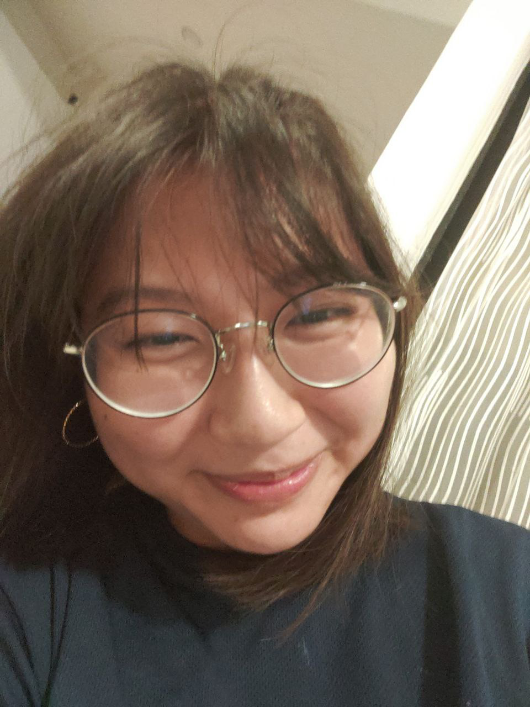

We are a team based in the [School of Computing, National University of Singapore](http://www.comp.nus.edu.sg).

You can reach us at the email `seer[at]comp.nus.edu.sg`

## Project team

### John

[[homepage](http://www.comp.nus.edu.sg/~damithch)]
[[github](https://github.com/johnrhimawan)]
[[portfolio](team/johnrhimawan.md)]

* Role: Developer
* Responsibilities: Something

### Kang Qiao

[[github](https://github.com/kangqiao322)]
[[portfolio](team/kangqiao322.md)]

* Role: Developer
* Responsibilities: Something

### Jet

[[github](http://github.com/jetlfj)] [[portfolio](team/jetlfj.md)]

* Role: Developer
* Responsibilities: Features, Code Quality, Documentation, Testing, UI 

### Charlton

[[github](http://github.com/bigcrushes)]
[[portfolio](team/bigcrushes.md)]

* Role: Developer
* Responsibilities: Dev Ops + Threading

### Chantell

[[github](http://github.com/chantellyu)]
[[portfolio](team/chantellyu.md)]

* Role: Developer
* Responsibilities: UI
