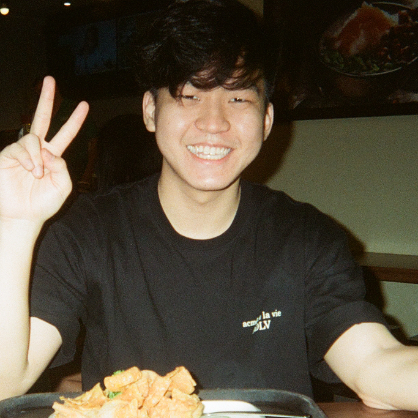
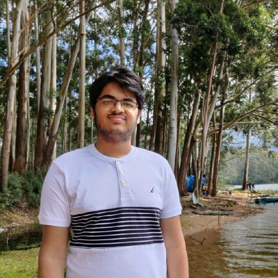
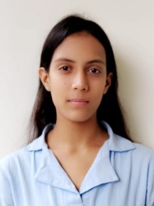

We are a team based in the [School of Computing, National University of Singapore](http://www.comp.nus.edu.sg).

You can reach us at the email `seer[at]comp.nus.edu.sg`

## Project team

### Joseph Aedan Marcus

[[github](https://github.com/josephaedan)]
[[portfolio](team/josephaedan.md)]

* Role: Developer
* Responsibilities: UI and Feature Implementation

### Pratham Jain

[[github](https://github.com/pratham31012002)]
[[portfolio](team/pratham31012002.md)]

* Role: Developer
* Responsibilities: Scheduling and tracking

### Anjali Agarwal

[[github](http://github.com/agarwal-anjali)] 
[[portfolio](team/agarwal-anjali.md)]

* Role: Developer
* Responsibilities: Integration

### Marcus Tan

[[github](http://github.com/emptygx)]
[[portfolio](team/marcustan.md)]

* Role: Developer
* Responsibilities: UI and Design

### James Doe

[[github](http://github.com/johndoe)]
[[portfolio](team/johndoe.md)]

* Role: Developer
* Responsibilities: UI
