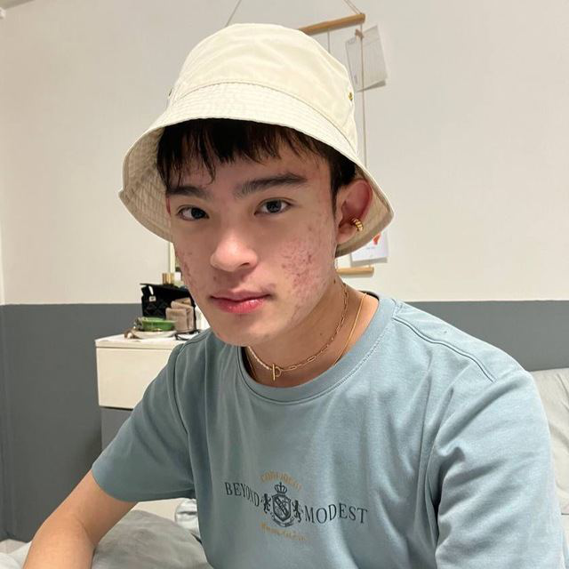
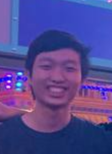
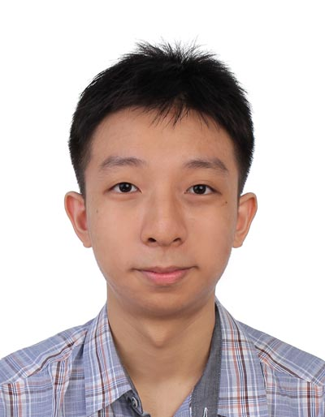
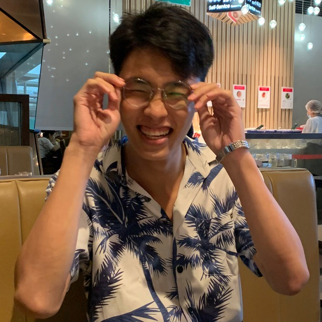

We are a team based in the [School of Computing, National University of Singapore](http://www.comp.nus.edu.sg).

## Project team

### Danny (Kim Hyeongcheol)

[github](https://github.com/bluesky0911) |
[portfolio](team/bluesky0911.md)

* Role: Project Advisor, Head Tutor (CS2103T)

### Ek Wei Rui

[github](https://github.com/ekweirui) |
[portfolio](team/ekweirui.md)

* Role: Developer
* Responsibilities:
  * Implement contacts management
  * Team pull request reviewer

### Neo Shi Wen

[github](http://github.com/shwene) |
[portfolio](team/shwene.md)

* Role: Developer
* Responsibilities:
  * Implement links

### Tan Chee Heng

[github](http://github.com/cheeheng) |
[portfolio](team/cheeheng.md)

* Role: Developer / Tester
* Responsibilities:
  * In charge of modules
  * (coming soon)

### Tan Jia Rong

[github](https://github.com/Tan-Jia-Rong) |
[portfolio](team/tan-jia-rong.md)

* Role: Developer
* Responsibilities:
  * Implement homepage and module navigation

### Teo Yu Qi

[github](http://github.com/teoyuqi) |
[portfolio](team/teoyuqi.md)
* Developer
* Responsibilities:
  * Implement task adding, deleting and swapping
  * UI
