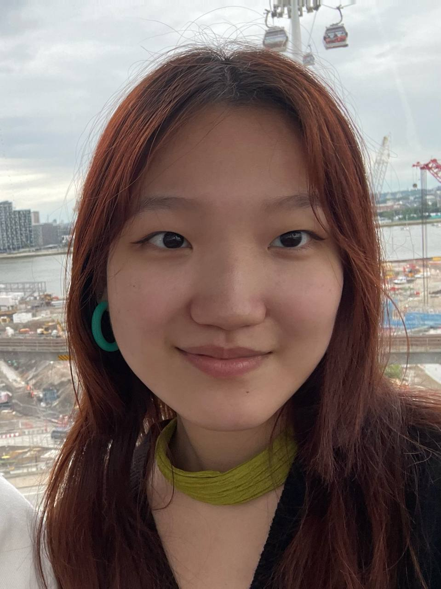
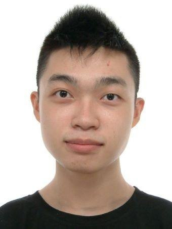
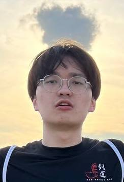
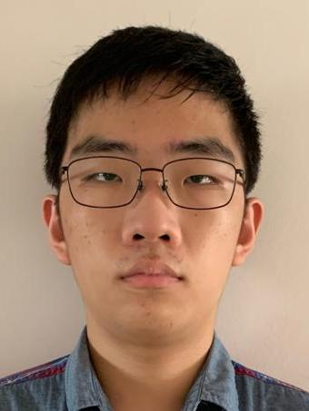
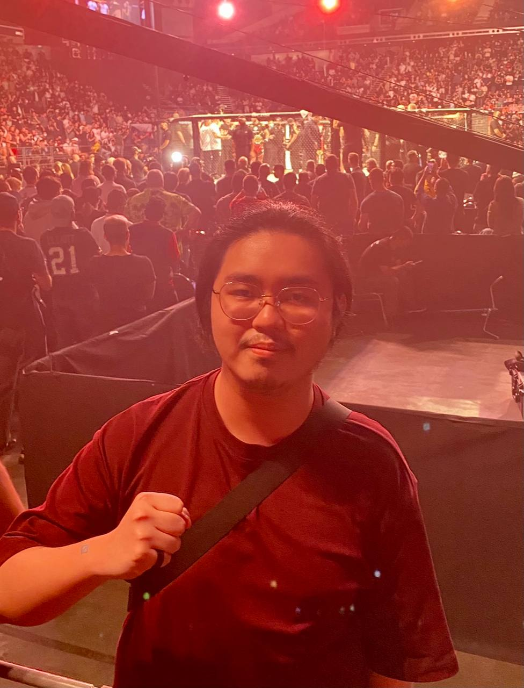

We are a team based in the [School of Computing, National University of Singapore](http://www.comp.nus.edu.sg).

You can reach us at the email `seer@comp.nus.edu.sg`

## Project Team

### Sun Ruoxin

[[github](https://github.com/vantemoon)]
[[portfolio](team/vantemoon.md)]

* Role: Developer
* Responsibilities: Scheduling and Tracking

### Khor Jun Wei

[[github](http://github.com/kjunwei)]
[[portfolio](team/kjunwei.md)]

* Role: Developer
* Responsibilities: Testing

### Chong Xi Yuen, Terence

[[github](http://github.com/cxyterence)] 
[[portfolio](team/cxyterence.md)]

* Role: Developer
* Responsibilities: Deliverables and Deadlines

### Guo Wei

[[github](http://github.com/guowei42)]
[[portfolio](team/guowei42.md)]

* Role: Developer
* Responsibilities: Integration

### Wee Xin Yang, Markus

[[github](http://github.com/yellow-294)]
[[portfolio](team/yellow-294.md)]

* Role: Developer
* Responsibilities: Code Quality
