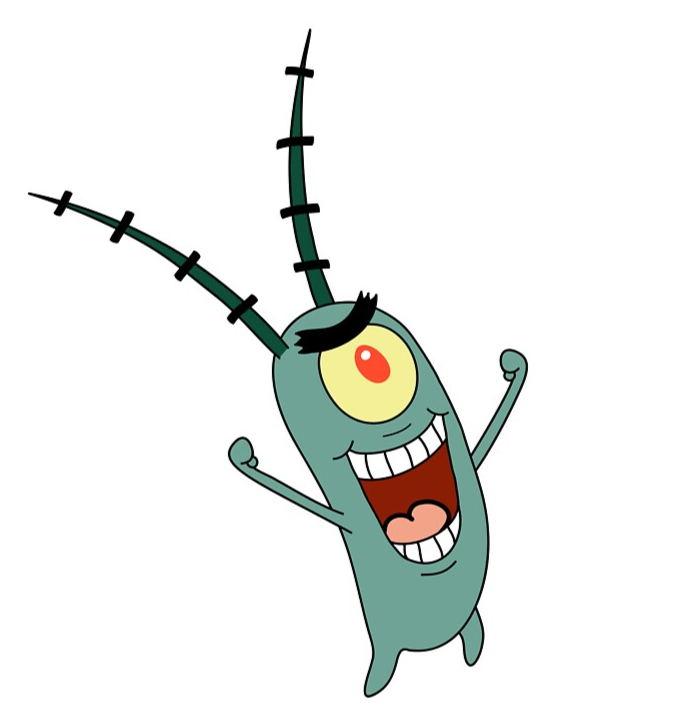
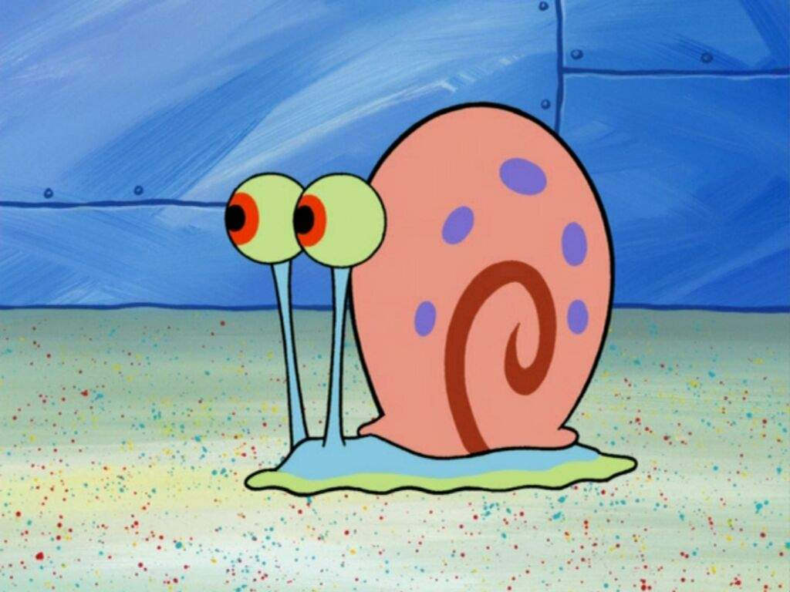

We are a team based in the [School of Computing, National University of Singapore](http://www.comp.nus.edu.sg).

## Project team

### Caden Cheong Jun Kai

[[github](https://github.com/cadencjk)
[portfolio](team/cadencjk.md)]

* Role: Project Advisor

### Sean Er Wen Han

[[github](http://github.com/seanflyyy)]
[[portfolio](team/seanflyyy.md)]

* Role: Team Lead
* Responsibilities: UI

### Sim Fang Ling, Joan

[[github](https://github.com/sjoann)]
[[portfolio](team/sjoann.md)]

* Role: Developer
* Responsibilities: Data

### Sun Xinyu

[[github](http://github.com/Echomo-Xinyu)][[portfolio](team/echomo-xinyu.md)]

* Role: Developer Head
* Responsibilities: Code Review and Backend Code

### Zhang Yue

[[github](http://github.com/gnahzeus)]
[[portfolio](team/gnahzeus.md)]

* Role: Developer
* Responsibilities: UI
