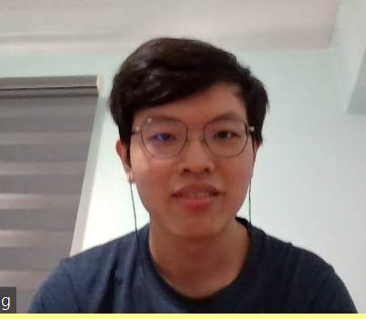
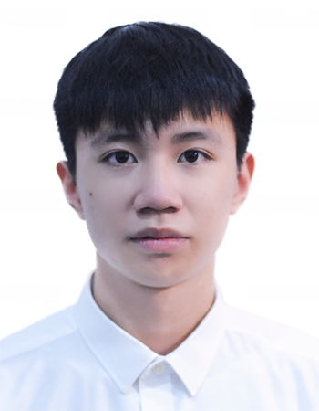
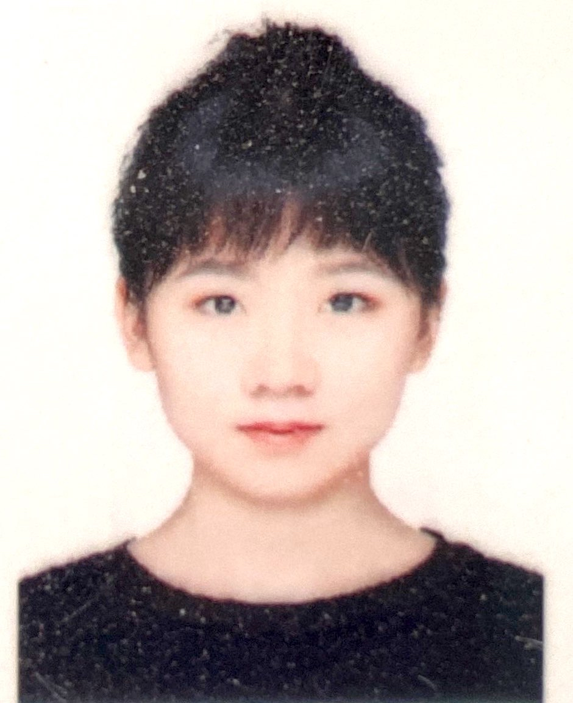

We are a team based in the [School of Computing, National University of Singapore](http://www.comp.nus.edu.sg).

You can reach us at the email `seer[at]comp.nus.edu.sg`

## Project team

### Hao Sitong

[[homepage](http://www.comp.nus.edu.sg/~damithch)]
[[github](https://github.com/o-ohst)]
[[portfolio](team/o-ohst.md)]

* Role: Team Lead
* Responsibilities: Overall project coordination

### Ong Zheng Long

[[github](https://github.com/ZhengLong3)]
[[portfolio](team/zhenglong3.md)]

* Role: Developer
* Responsibilities: Iteration, Testing

### Nguyen Quy Duc

[[github](https://github.com/ngquyduc)]
[[portfolio](team/ngquyduc.md)]

* Role: Developer
* Responsibilities: Iteration, Testing

### Yap Sien Soon

[[github](https://github.com/ssyap98)]
[[portfolio](team/ssyap98.md)]

* Role: Developer
* Responsibilities: Documentation

### Zhang Bokun

[[github](http://github.com/bokun2)]
[[portfolio](team/bokun2.md)]

* Role: Developer
* Responsibilities: UI
