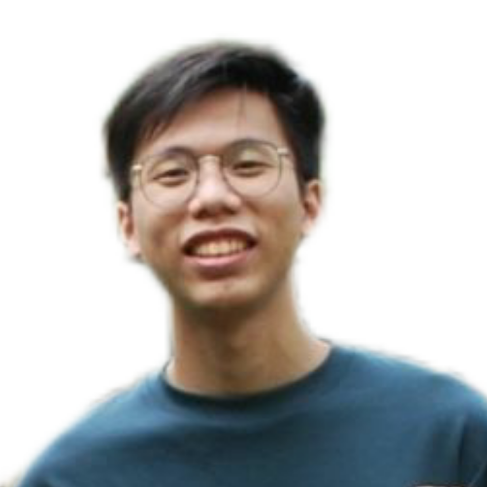

We are a team based in the [School of Computing, National University of Singapore](http://www.comp.nus.edu.sg).

You can reach us at the email `seer@comp.nus.edu.sg`

## Project team

### Jiang Zhimeng

[[github](https://github.com/asaierika)]
[[portfolio](team/asaierika.md)]

* Role: Developer
* Responsibilities: UI

### Loh Teng Wye

[[github](http://github.com/nopehax)]
[[portfolio](team/nopehax.md)]

* Role: Developer
* Responsibilities: Storage

### Ong Wen Pin

[[github](http://github.com/ongwenpin)] [[portfolio](team/ongwenpin.md)]

* Role: Developer
* Responsibilities: Model

### Tan Tze Yeong

[[github](http://github.com/tantzeyeong)]
[[portfolio](team/tantzeyeong.md)]

* Role: Developer
* Responsibilities: Model

### Totsuka Tomofumi

[[github](https://github.com/totsukatomofumi)] [[portfolio](team/totsukatomofumi.md)]

* Role: Developer
* Responsibilities: Logic
