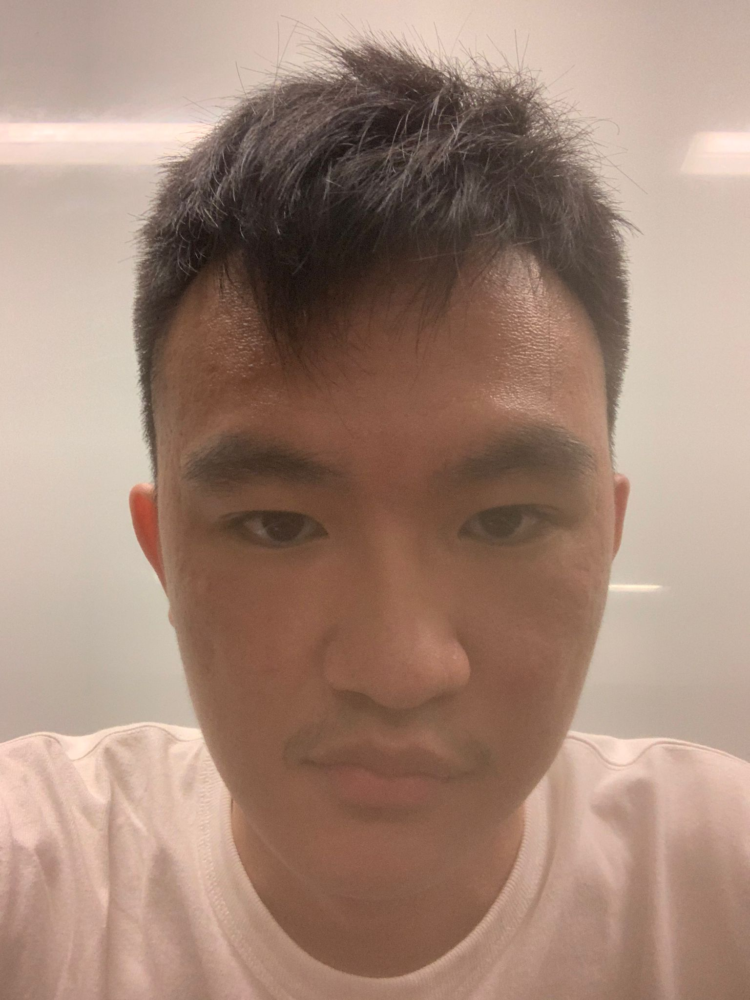

We are a team based in the [School of Computing, National University of Singapore](http://www.comp.nus.edu.sg).

You can reach us at the email `seer[at]comp.nus.edu.sg`

## Project team

### Elton Chua

[[homepage](http://www.comp.nus.edu.sg/~damithch)]
[[github](https://github.com/notle1706)]
[[portfolio](team/notle1706.md)]

* Role: Developer
* Responsibilities: Dev Ops, Code Quality

### Jicson Toh

[[github](http://github.com/jicsontoh)]
[[portfolio](team/jicsontoh.md)]

* Role: Developer
* Responsibilities: Dev Ops, Testing

### Joel Wong

[[github](http://github.com/Jo3LW)] [[portfolio](team/jo3lw.md)]

* Role: Developer
* Responsibilities: Integration

### Elgin Lee Yiheng

[[github](http://github.com/ElginL)]
[[portfolio](team/elginl.md)]

* Role: Developer
* Responsibilities:
    - Team Lead
    - Deliverables and Deadlines
    - Scheduling and Tracking

### Nam Minh Quan

[[github](http://github.com/quannam0124)]
[[portfolio](team/quannam0124.md)]

* Role: Developer
* Responsibilities: Dev Ops, Documentation, Code Quality

