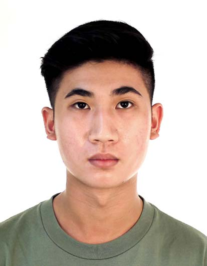
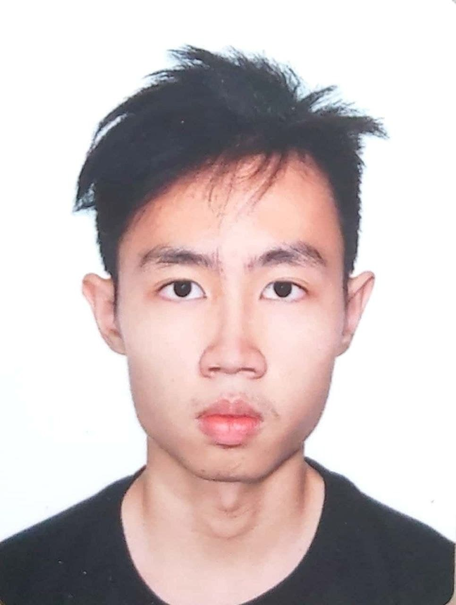

We are a team based in the [School of Computing, National University of Singapore](http://www.comp.nus.edu.sg).

You can reach us at the email `seer[at]comp.nus.edu.sg`

## Project team

### Brendan Tan

[[github](https://github.com/nerbnerb)]
[[portfolio](team/nerbnerb.md)]

* Role: Developer
* Responsibilities: UI

### Desmond Yong Shao Tian

[[github](https://github.com/desmondyst)]
[[portfolio](team/desmondyst.md)]

* Role: Developer
* Responsibilities: Data

### Johnny Doe

[[github](http://github.com/johndoe)] [[portfolio](team/johndoe.md)]

* Role: Developer
* Responsibilities: Data

### Marcus Isaac Goh Wei Jie

[[github](https://github.com/Marcusgwj)]
[[portfolio](team/Marcusgwj.md)]

* Role: Developer
* Responsibilities: Data

### Tee Yi Teng

[[github](https://github.com/Puakii)]
[[portfolio](team/johndoe.md)]

* Role: Developer
* Responsibilities: UI
