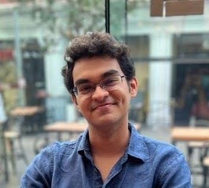
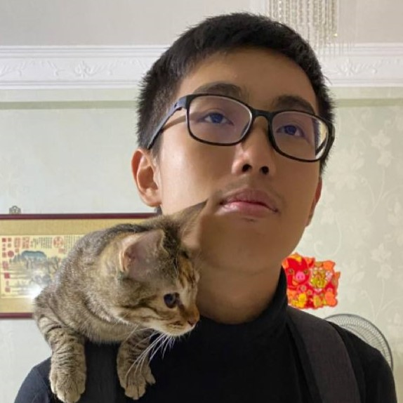
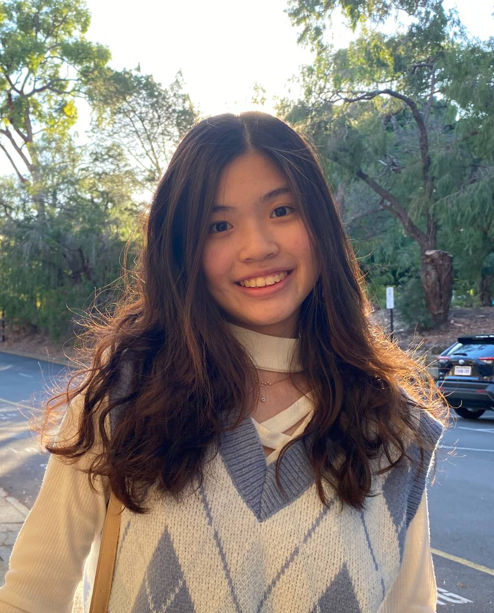

We are a team based in the [School of Computing, National University of Singapore](http://www.comp.nus.edu.sg).

You can reach us at the email `seer[at]comp.nus.edu.sg`

## Project team

### Devansh Shah

[homepage](https://www.linkedin.com/in/devansh-shah-305a59201/)

[github](https://github.com/devanshshah1309)

[portfolio](team/devanshshah1309.md)

* Role: Developer

### Marcus Pang

[homepage](https://www.linkedin.com/in/marcus-pang-yu-yang/)

[github](http://github.com/marcuspang)

[portfolio](team/marcuspang.md)

* Role: Developer

### Gui Ling Ling

[github](http://github.com/ling-ui)

[portfolio](team/ling-ui.md)

* Role: Developer

### Jean Doe

[[github](http://github.com/johndoe)]
[[portfolio](team/johndoe.md)]

* Role: Developer
* Responsibilities: Dev Ops + Threading

### James Doe

[[github](http://github.com/johndoe)]
[[portfolio](team/johndoe.md)]

* Role: Developer
* Responsibilities: UI
