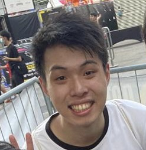
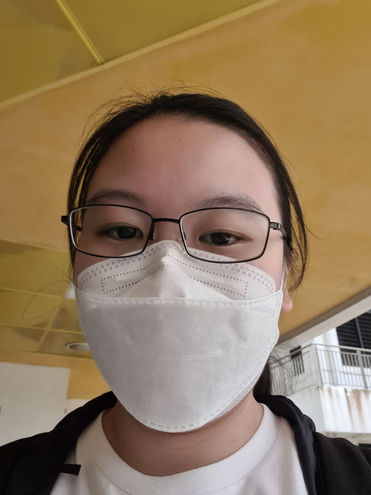
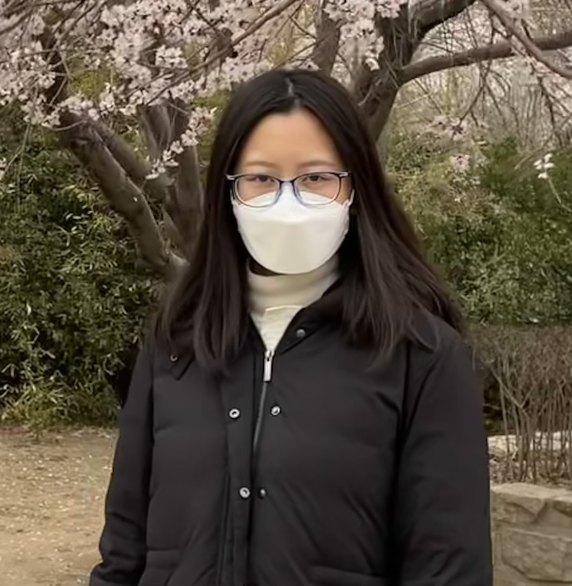
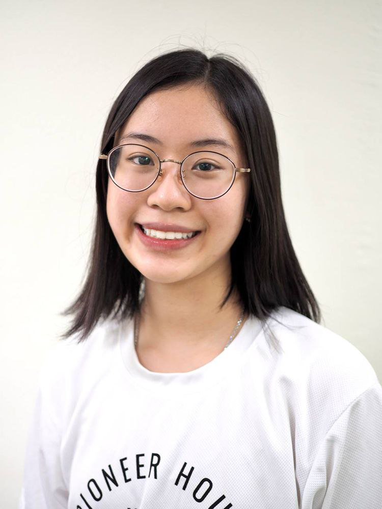
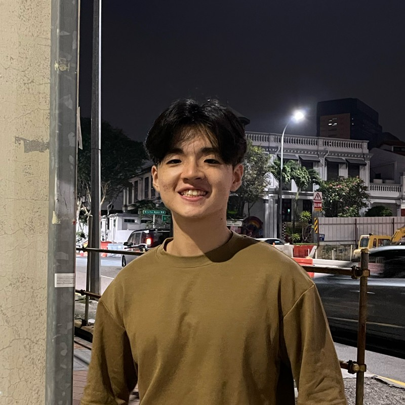

We are a team based in the [School of Computing, National University of Singapore](http://www.comp.nus.edu.sg).

You can reach us at the email `seer[at]comp.nus.edu.sg`

## Project team

### Lau Rui Han

[[github](https://github.com/ruihan00)]
[[portfolio](team/ruihan00.md)]

* Role: Project Advisor

### Emily Ong Hui Qi

[[github](http://github.com/EmilyOng)]
[[portfolio](team/EmilyOng.md)]

* Role: Developer
* Responsibilities: UI

### Zhu Yuanxi

[[github](http://github.com/yuanxi1)] [[portfolio](team/yuanxi1.md)]

* Role: Developer
* Responsibilities: Data

### Sharmaine Teo

[[github](http://github.com/sharmaine1028)]
[[portfolio](team/sharmaine1028.md)]

* Role: Developer
* Responsibilities: Project Manager

### Jason Yap

[[github](http://github.com/jasonyapzx)]
[[portfolio](team/jasonyapzx.md)]

* Role: Developer
* Responsibilities: Scheduling and Tracking of tasks
