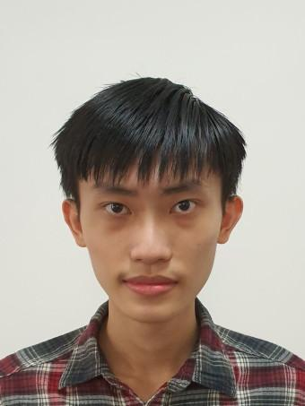
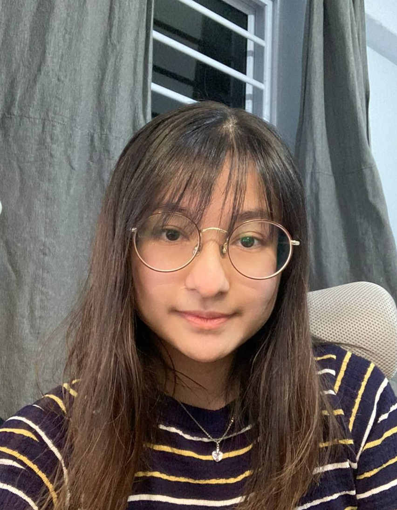
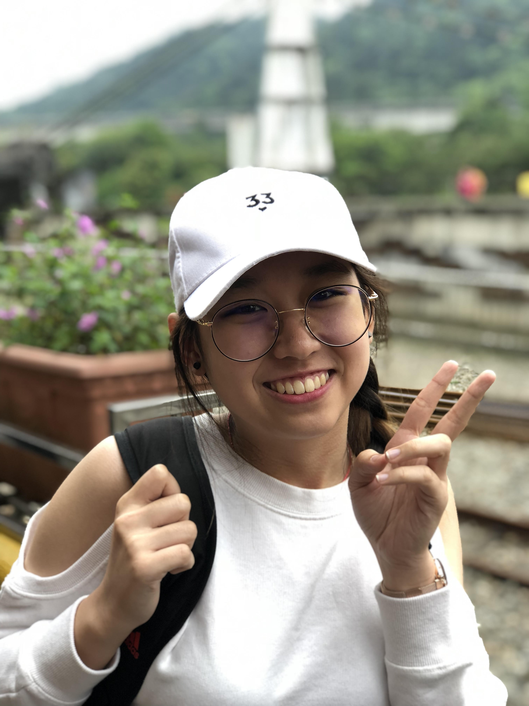
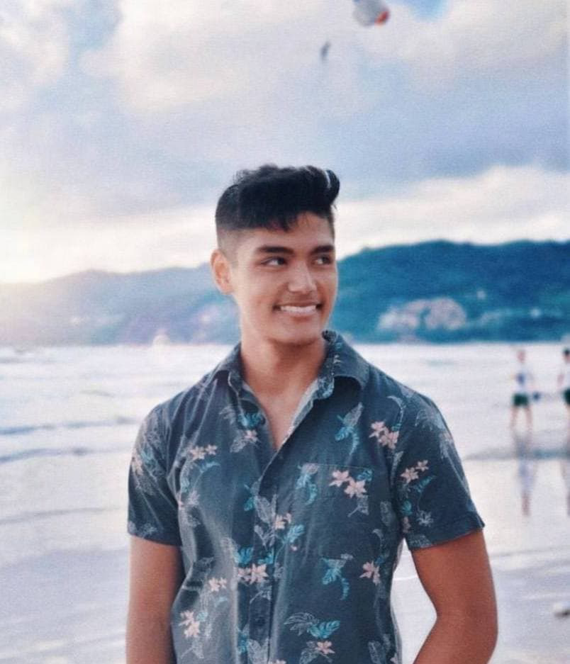
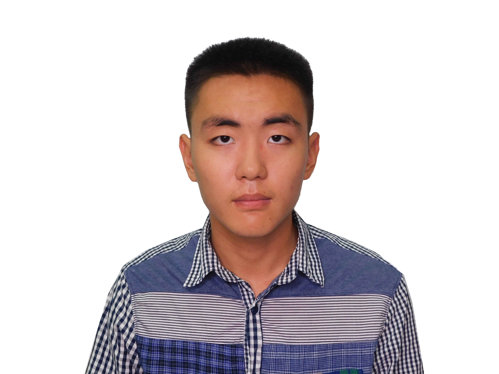

We are a team based in the [School of Computing, National University of Singapore](http://www.comp.nus.edu.sg).

You can reach us at the email `seer[at]comp.nus.edu.sg`

## Project team

### Lee Care Gene

[[github](https://github.com/leecaregene)][[portfolio](team/leecaregene.md)]

Roles:

* Code quality
* Integration

### Jovita Anderson

[[github](https://github.com/jovitaanderson)][[portfolio](team/jovitaanderson.md)]

Roles:

* Team Lead

### Shanice Ng Wen Yi

[[github](https://github.com/shaniceng)][[portfolio](team/shaniceng.md)]

Roles:

* Deliverables and deadlines
* Scheduling and tracking

### Singh Abdullah Alexander

[[github](https://github.com/alexandermula)][[portfolio](team/alexandermula.md)]

Roles:

* Documentation

### Tan Yuan Zheng

[[github](https://github.com/YZTangent)][[portfolio](team/yztangent.md)]

Roles:

* Testing
