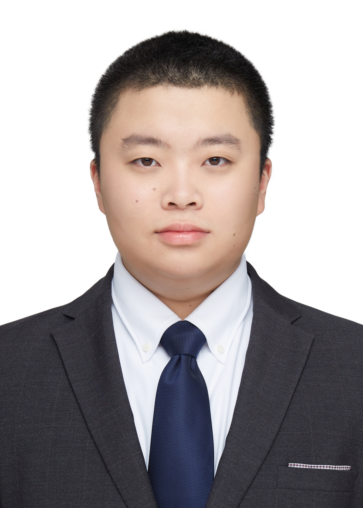
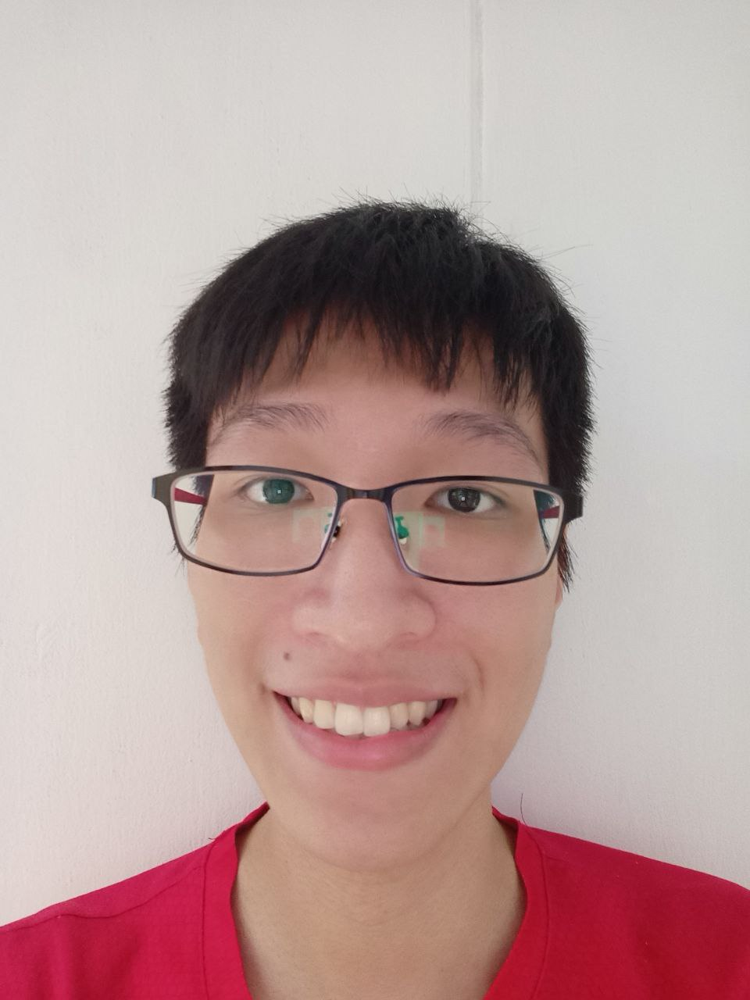
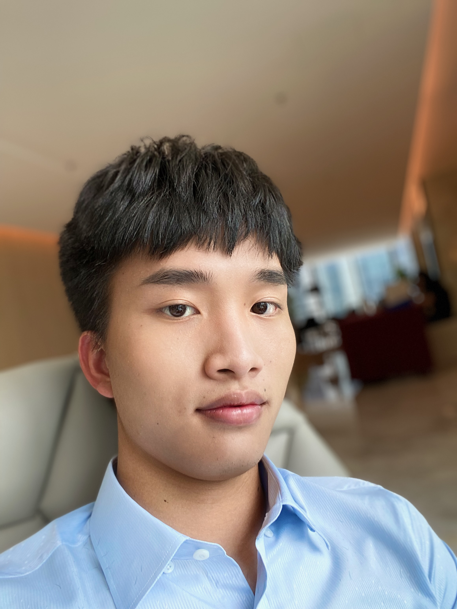

<link rel="shortcut icon" type="image/x-icon" href="favicon.ico">
---
layout: page
title: About Us
---

We are a team based in the [School of Computing, National University of Singapore](http://www.comp.nus.edu.sg).

You can reach us at the email `seer[at]comp.nus.edu.sg`

### Samuel Koh

[[github]](https://github.com/Samsation)
[[portfolio]](team/samsation.md)

* Role: Developer
* Responsibilities: Dev Ops + Threading

### Benjamin Soh

[[github]](https://github.com/bensohh)
[[portfolio]](team/bensohh.md)

* Role: Developer
* Responsibilities: Dev Ops + Threading

### Albert Zhang

[[github]](https://github.com/albertzhangtj)
[[portfolio]](team/albertzhangtj.md)

* Role: Developer
* Responsibilities: Backend

### Tan Wen Cong

[[github]](http://github.com/tanwencong)
[[portfolio]](team/tanwencong.md)

* Role: Developer
* Responsibilities: Data

### Wu Haohui

[[github](https://github.com/WuHaohui1231)]
[[portfolio](team/wuhaohui1231.md)]

* Role: Developer
* Responsibilities: Backend
