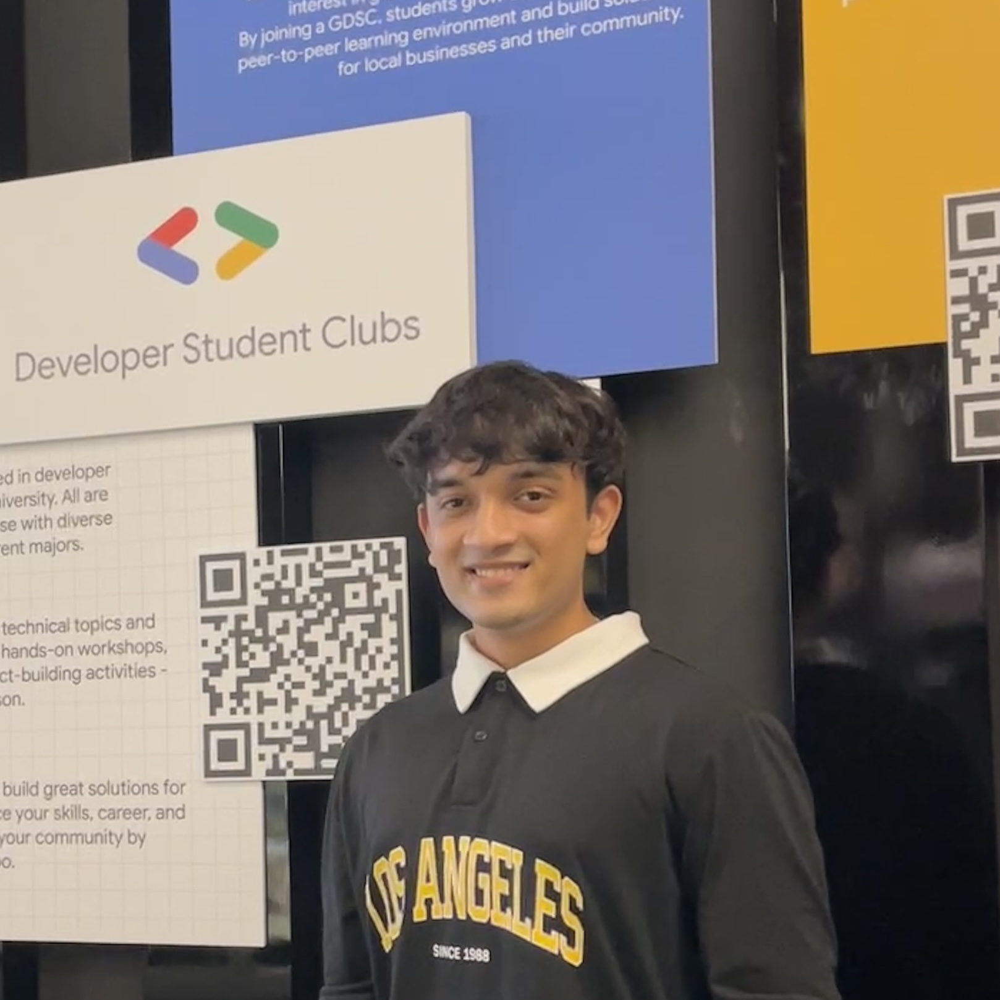
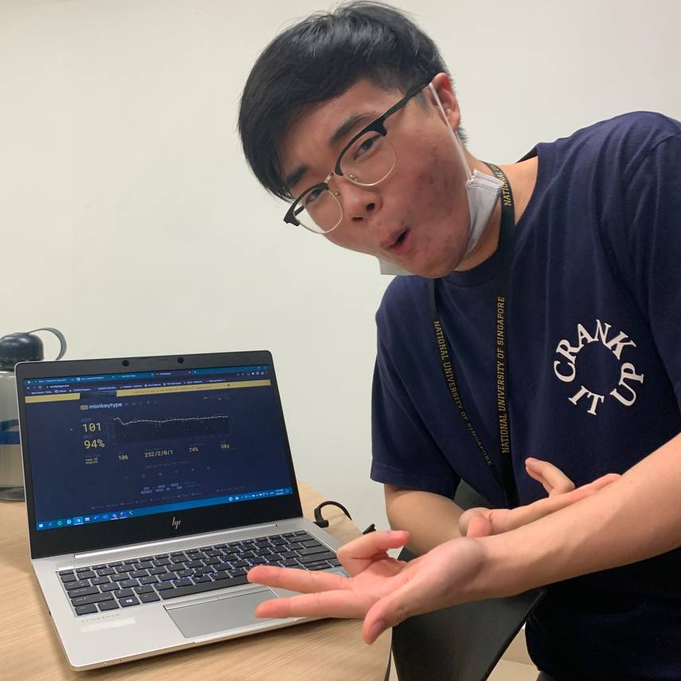

We are a team based in the [School of Computing, National University of Singapore](http://www.comp.nus.edu.sg).

You can reach us at our emails:
1. Pei Yee: `peiyee88@u.nus.edu`
2. Kartik: `kartikeya@u.nus.edu`
3. Zhehao: `x_z@u.nus.edu`
4. Ryan: `e0725246@u.nus.edu`
5. Yuchen: `hyuchen@u.nus.edu`

## Project team

### Pei Yee Cheng

[[github](https://github.com/peiyee88)]
[[portfolio](team/peiyee88.md)]

* Role: Developer

### Kartikeya

[[github](http://github.com/kxrt)]
[[portfolio](team/kxrt.md)]

* Role: Developer

### Zhehao

[[github](http://github.com/Charles1026)]
[[portfolio](team/charles1026.md)]

* Role: Developer
* Responsibilities: Sandbagging

### Ryan Tan

[[github](https://github.com/Ryan-Tan00)]
[[portfolio](team/ryan-tan00.md)]

* Role: Developer
* Responsibilities: Sandbagging BUT harder

### Huang Yuchen

[[github](http://github.com/nehcuy)]
[[portfolio](team/nehcuy.md)]

* Role: Developer
