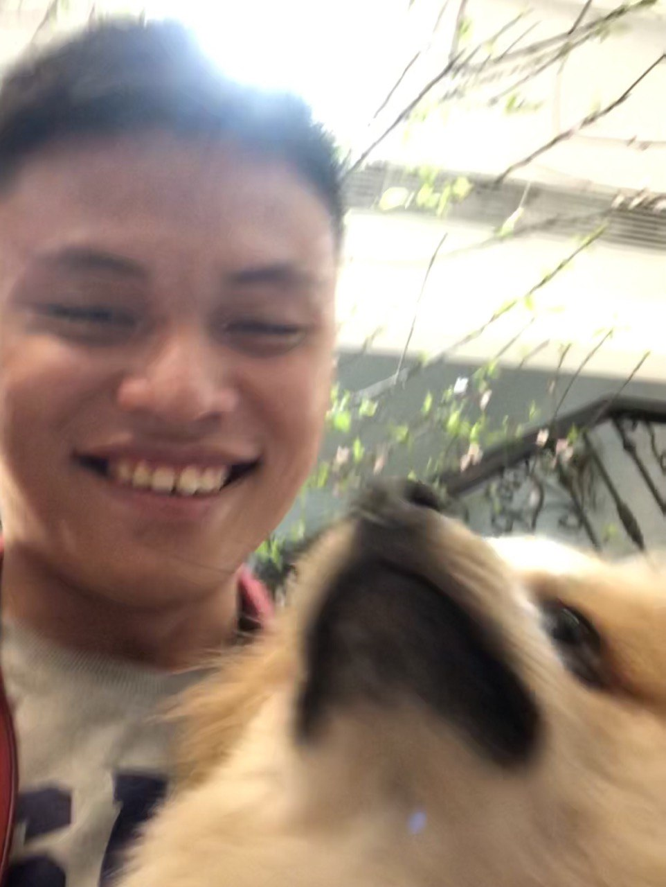

We are a team based in the [School of Computing, National University of Singapore](http://www.comp.nus.edu.sg).

You can reach us at the email `seer[at]comp.nus.edu.sg`

## Project team

### Low Weimin, Ian

[[github](https://github.com/castryl)]
[[portfolio](team/johndoe.md)]

* Role: Developer
* Responsibilities: Documentation

### Guo Qi

[[github](http://github.com/NUSDG)]
[[portfolio](team/nusdg.md)]

* Role: Developer
* Responsibilities: Testing

### Jeremy Toh

[[github](http://github.com/deepimpactmir)] [[portfolio](team/johndoe.md)]

- Role: Developer
- Responsibilities: Code quality

### Keith Png

[[github](http://github.com/KeithPJX)]
[[portfolio](team/johndoe.md)]

* Role: Developer
* Responsibilities: Deliverables and deadlines

### Ryan Lee

[[github](http://github.com/ryanlml)]
[[portfolio](team/johndoe.md)]

* Role: Developer
* Responsibilities: Integration
