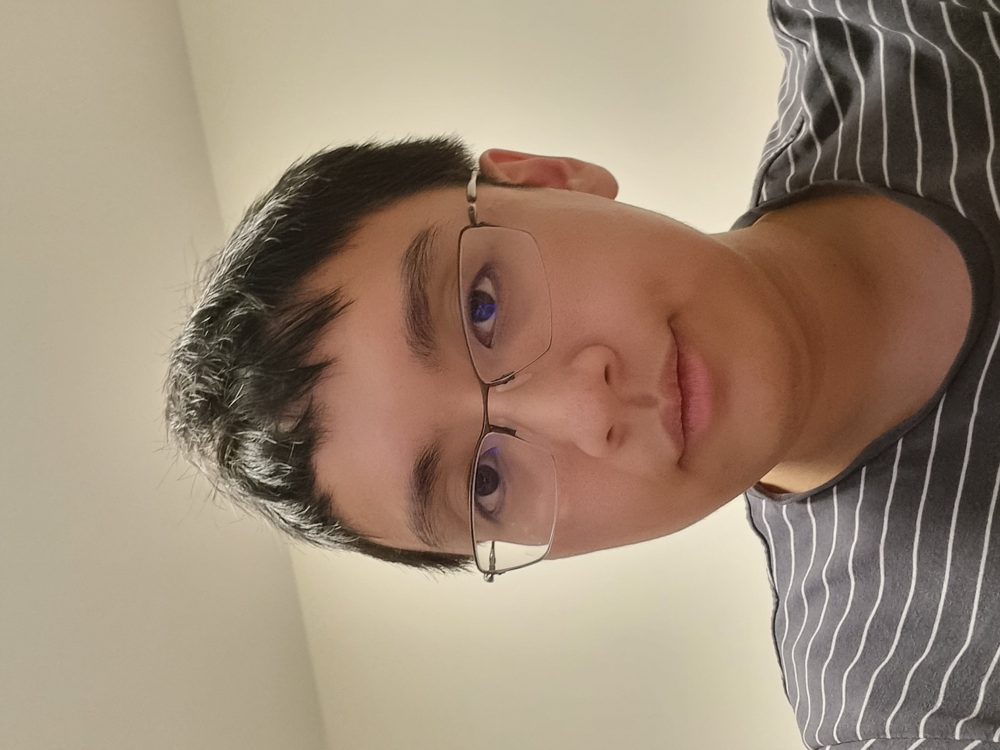
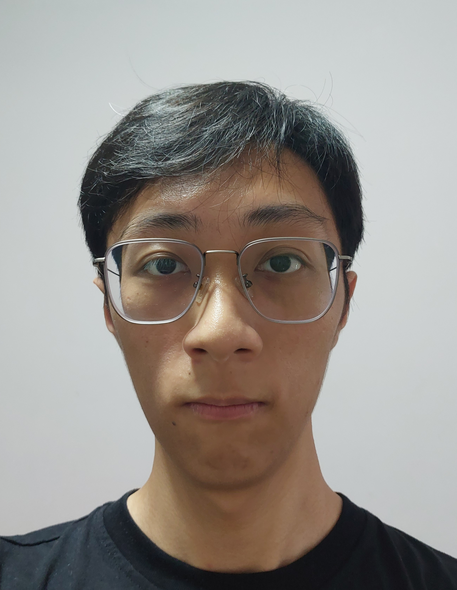
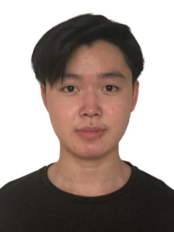
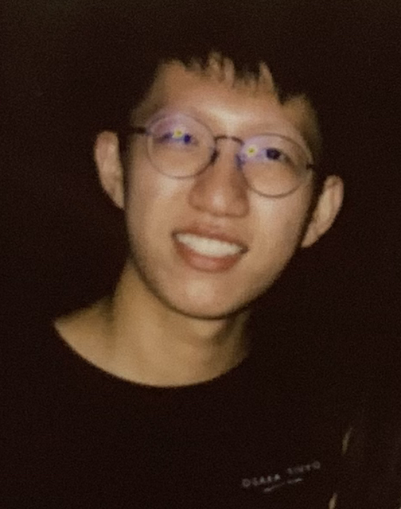
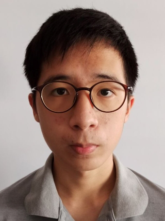

We are a team based in the [School of Computing, National University of Singapore](http://www.comp.nus.edu.sg).

You can reach us at the email `seer[at]comp.nus.edu.sg`

## Project team

## Tjan Eng Ger, Kevin

[[github](https://github.com/Nephelite)]
[[portfolio](team/nephelite.md)]

* Role: Team Leader, Gradle Expert, Agenda Maker, Developer
* Responsibilities: UI, Logic

### See Toh Jin Wei

[[github](https://github.com/seetohjinwei)]
[[portfolio](team/seetohjinwei.md)]

* Role: Developer
* Responsibilities: Integration, Logic, Commons, DevOps

### Humphrey

[[github](http://github.com/bananamonkey4655)]
[[portfolio](team/bananamonkey4655.md)]

* Role: Developer
* Responsibilities: Deliverables and Deadlines, Model, UI

### Bill

[[github](http://github.com/xiaobill8)]
[[portfolio](team/xiaobill8.md)]

* Role: Developer
* Responsibilities: Testing, Model, Storage

### Sim Choon Hong Dexter

[[github](http://github.com/dexter-sim)]
[[portfolio](team/dexter-sim.md)]

* Role: Developer
* Responsibilities: Code Quality, Scheduling and Tracking, Logic, Storage
