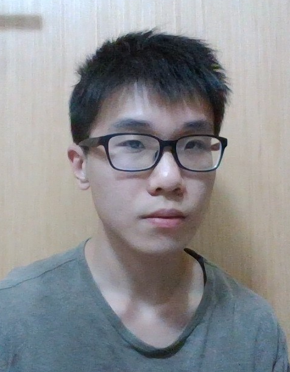
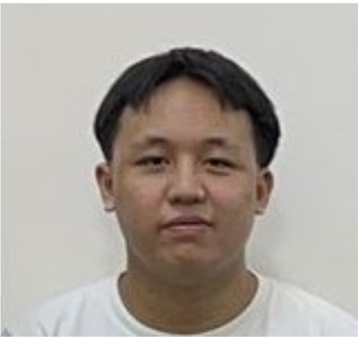

We are a team based in the [School of Computing, National University of Singapore](http://www.comp.nus.edu.sg).

You can reach us at our Github links, click on each individual name to be brought to each of our Github profiles.

## Project team

### [T Neethesh](https://github.com/Neethesh26)

[[github](https://github.com/Neethesh26)]
[[portfolio](team/johndoe.md)]

* Role:
Responsibilities:

### [Chen Ruihan](https://github.com/rui-han-crh)

[[github](http://github.com/rui-han-crh)]
[[portfolio](team/rui-han-crh.md)]

* Role: Developer
* Responsibilities: 
  * User Interface
  * Feature (Loans)
  * English Proofreading
  * Project Embellishments

### [Ryan Chua](https://github.com/ryanczx)

[[github](http://github.com/ryanczx)]
[[portfolio](team/ryanczx.md)]

* Role:
* Responsibilities:

### [Chee Zhong Wei](https://github.com/czhongwei)

[[github](http://github.com/czhongwei)]
[[portfolio](team/czhongwei.md)]

* Role:
* Responsibilities:

### [Jiang Pinran](https://github.com/Pinran-J)

[[github](http://github.com/Pinran-J)]
[[portfolio](team/pinran-j.md)]

* Role:
* Responsibilities:
