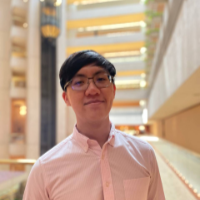
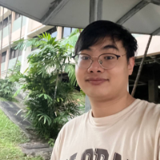
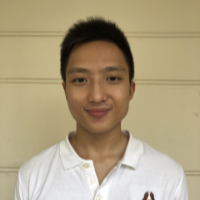
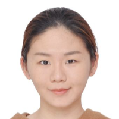

We are a team based in the [School of Computing, National University of Singapore](http://www.comp.nus.edu.sg).

You can reach us at the email `seer[at]comp.nus.edu.sg`

## Project team

### Damith

[[homepage](http://www.comp.nus.edu.sg/~damithch)]
[[github](https://github.com/damithc)]
[[portfolio](team/johndoe.md)]

* Role: Project Advisor

### Ezra Tio

[[github](https://github.com/e1010101)]
[[portfolio](team/johndoe.md)]

* Role: X
* Responsibilities: X

### Gregg Chan

[[github](http://github.com/Hoodineee)]
[[portfolio](team/johndoe.md)]

* Role: X
* Responsibilities: X

### Jonathan Goh

[[github](http://github.com/jgyj123)]
[[portfolio](team/johndoe.md)]

* Role: X
* Responsibilities: X

### Soo Jia Xi

[[github](http://github.com/joosxi)]
[[portfolio](team/johndoe.md)]

* Role: X
* Responsibilities: X

### Xiao Ying

[[github](http://github.com/xiaoying1129)]
[[portfolio](team/johndoe.md)]

* Role: X
* Responsibilities: X