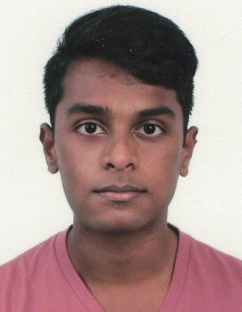
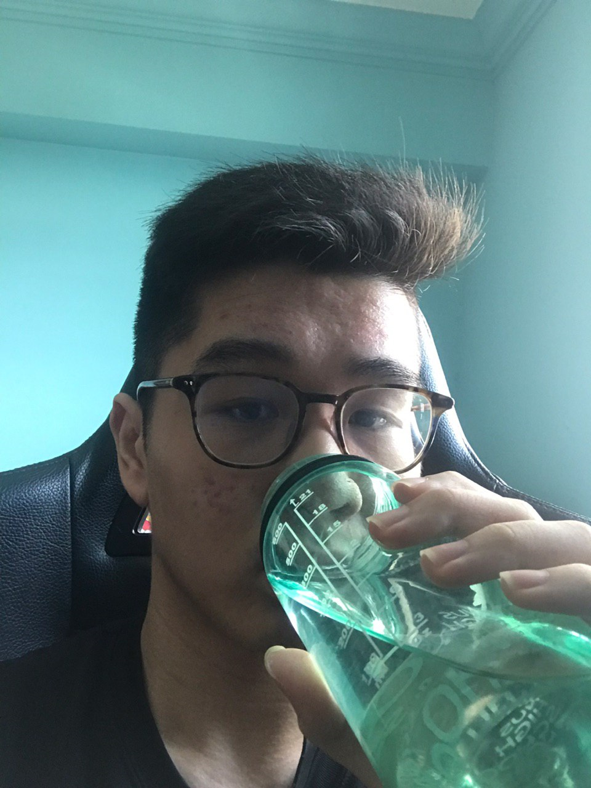
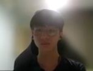
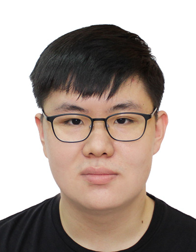
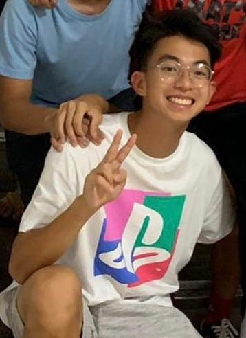

We are a team based in the [School of Computing, National University of Singapore](http://www.comp.nus.edu.sg).

You can reach us at the consultation `seer[at]comp.nus.edu.sg`

## Project FRIDAY

### Yuvaraj Kumaresan

[[github](https://github.com/Yuvaraj0702)]
[[portfolio](team/yuvaraj0702.md)]

* Role: Project Advisor
* Responsibilities: Data

### Darren Teo Zhi Jie

[[github](http://github.com/darrtzj)]
[[portfolio](team/darrtzj.md)]

* Role: Team Lead
* Responsibilities: UI

### Tan How Suen

[[github](http://github.com/HowSuen)]
[[portfolio](team/howsuen.md)]

* Role: Developer
* Responsibilities: Data

### Soh Jing Ren

[[github](http://github.com/jorrdansoh)]
[[portfolio](team/jorrdansoh.md)]

* Role: Developer
* Responsibilities: Data

### Yeo Kai Jiun

[[github](http://github.com/kaij77)]
[[portfolio](team/kaijiun.md)]

* Role: Developer
* Responsibilities: UI
