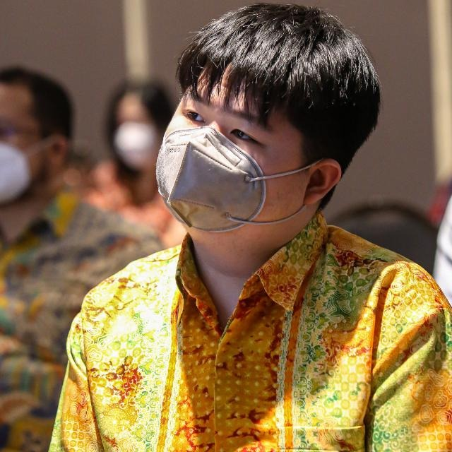
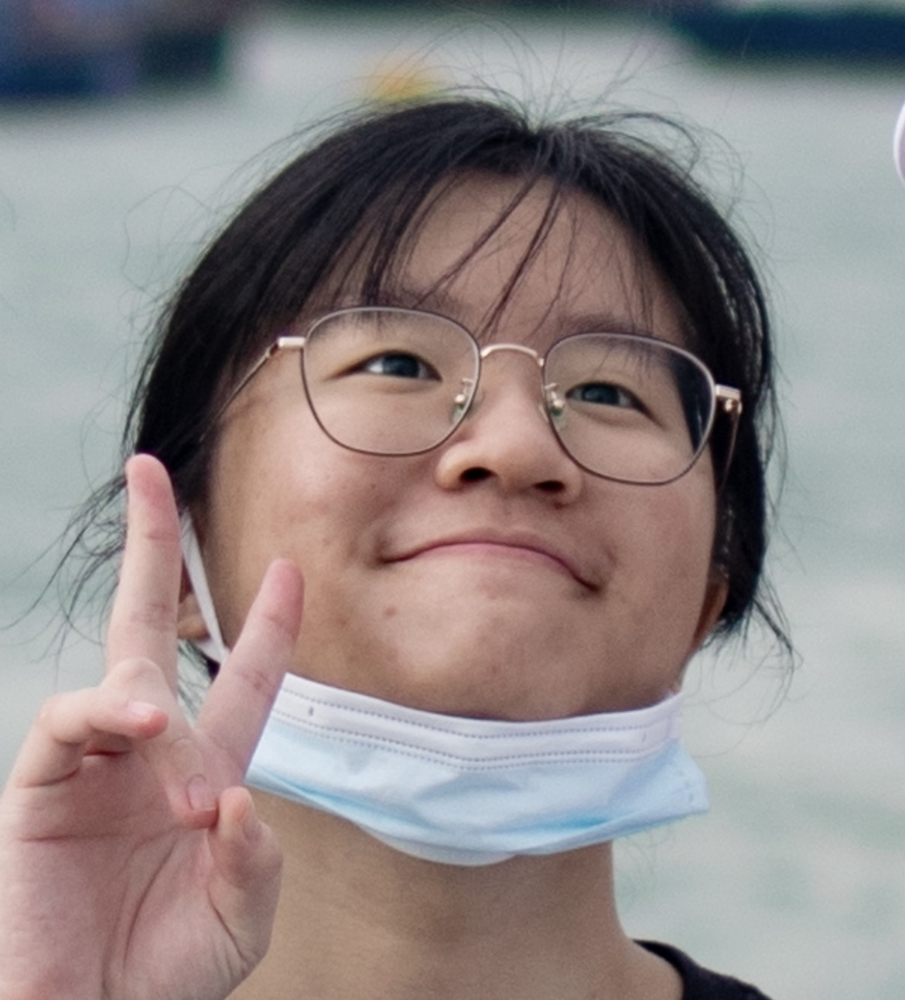
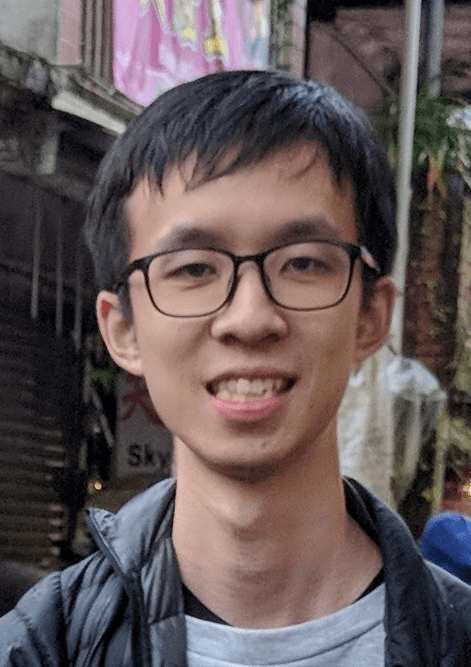

We are a team based in the [School of Computing, National University of Singapore](http://www.comp.nus.edu.sg).

## Project team

### Lin Zechen

[[github](https://github.com/Bubbl3T)]
[[portfolio](team/bubbl3t.md)]

* Role: Team Lead, IntelliJ Expert.
* Responsibilities: Deliverables and Deadlines, Integration, Logic IC, Model IC.

### Rezwan Arefin

[[github](http://github.com/RezwanArefin01)]
[[portfolio](team/rezwanarefin01.md)]

* Role: Team Lead. 
* Responsibilities: Code Quality, Git Expert, Logic IC. 

### Edbert Geraldy Cangdinata

[[github](http://github.com/berted)]
[[portfolio](team/berted.md)]

* Role: Developer. 
* Responsibilities: Documentation, Scheduling, Storage IC.

### Xu Yi

[[github](http://github.com/optionalemon)]
[[portfolio](team/optionalemon.md)]

* Role: Developer.
* Responsibilities: Testing, Deliverables and Deadlines, UI IC.

### Ng Jing Xue

[[github](http://github.com/njxue)]
[[portfolio](team/njxue.md)]

* Role: Developer. 
* Responsibilities: Integration, Documentation, Testing and Model.
