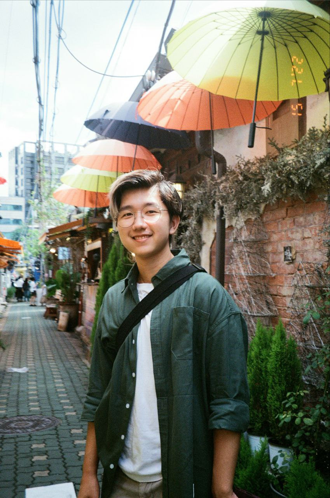
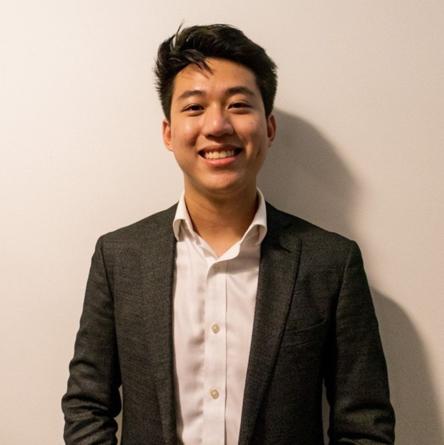

We are a team based in the [School of Computing, National University of Singapore](http://www.comp.nus.edu.sg).

## Project team

### Justin Peng

[[homepage](https://justinpeng.vercel.app)]
[[github](https://github.com/JustinPeng13)]
[[portfolio](team/justinpeng13.md)]

* Role: Secondary Team Lead
* Responsibilities: Deliverables and deadlines, Scheduling and tracking, Git/SourceTree expert

### Soh Je Hou

[[github](http://github.com/jehousoh)]
[[portfolio](team/jehousoh.md)]

* Role: Team Lead
* Responsibilities: Deliverables and deadlines, Scheduling and tracking

### Lan Jingbo

[[github](http://github.com/Lan-Jingbo)] [[portfolio](team/lanjingbo.md)]

* Role: Developer
* Responsibilities: Data, Testing, Project Management

### Kang Zong Xian

[[github](http://github.com/kangzongxian)]
[[portfolio](team/kangzongxian.md)]

* Role: Developer
* Responsibilities: Code Quality, Documentation

### Ho Cheng En Bryan

[[github](http://github.com/bryanhce)]
[[portfolio](team/bryanhce.md)]

* Role: Developer
* Responsibilities: Code quality, Documentation
