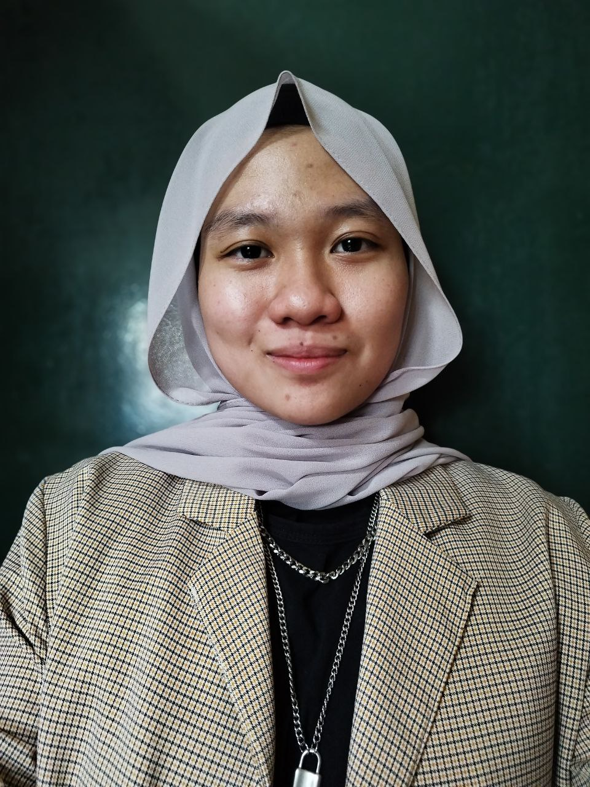
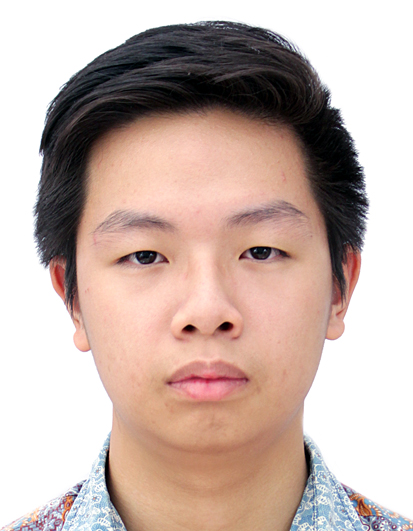
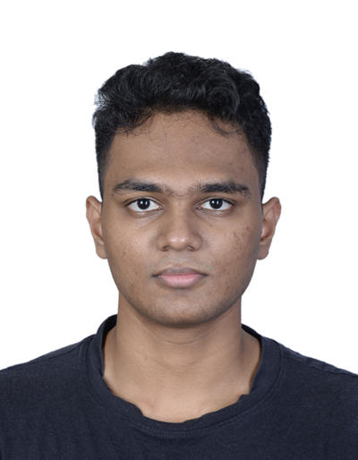

We are a team based in the [School of Computing, National University of Singapore](http://www.comp.nus.edu.sg).

## Project team

### 'Izzah Bte Abdul Jalil

[[github](https://github.com/izzahaj)]
[[portfolio](team/izzahaj.md)]

* Role: Team Lead
* Responsibilities: Deliverables and deadlines, Scheduling and tracking

### Jane Doe

[[github](http://github.com/johndoe)]
[[portfolio](team/johndoe.md)]

* Role: Team Lead
* Responsibilities: UI

### Johnny Doe

[[github](http://github.com/johndoe)] [[portfolio](team/johndoe.md)]

* Role: Developer
* Responsibilities: Data

### Shaugn Tan Sean Hon

[[github](http://github.com/shogun187)]
[[portfolio](team/shogun187.md)]

* Role: Developer
* Responsibilities: Documentation

### Rama Aryasuta Pangestu

[[github](https://github.com/rama-pang)]
[[portfolio](team/rama-pang.md)]

* Role: Developer
* Responsibilities: Testing

### Ramanathan Kumarappan

[[github](https://github.com/Ramanathan0908)]
[[portfolio](team/ramanathan0908.md)]

* Role: Developer
* Responsibilities: Integration
