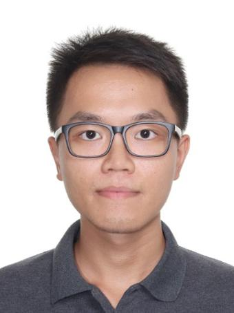

We are a team based in the [School of Computing, National University of Singapore](http://www.comp.nus.edu.sg).

You can reach us at the email `seer[at]comp.nus.edu.sg`

## Project team

### Ng Yan Jia

[[github](https://github.com/sprintaway)]
[[portfolio](team/ngyanjia.md)]

* Role: Developer

### Parth Gujar

[[github](http://github.com/parth-io)]
[[portfolio](team/parth-io.md)]

* Role: Developer
* Responsibilities: -

### Edward Mualim

[[github](https://github.com/edfernape)] [[portfolio](team/johndoe.md)]

* Role: Developer
* Responsibilities: -

### Teh Yi Kuang

[[github](http://github.com/TYKCodes)]
[[portfolio](team/tykcodes.md)]

* Role: Developer
* Responsibilities: -

### Kiyan Ang Ping Young

[[github](http://github.com/kynapy)]
[[portfolio](team/kynapy.md)]

* Role: Developer
* Responsibilities: -
