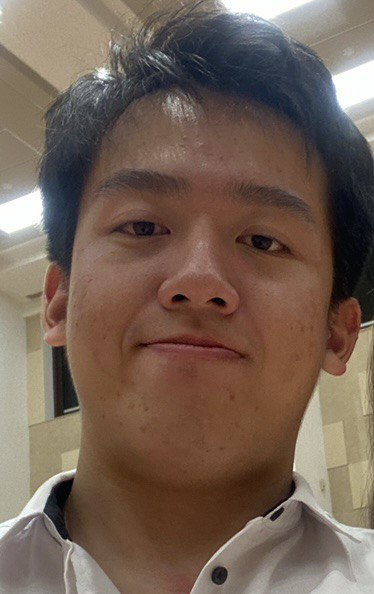

We are a team based in the [School of Computing, National University of Singapore](http://www.comp.nus.edu.sg).

You can reach us at the email `seer[at]comp.nus.edu.sg`

## Project team

### Guok Wei Jie

[[github](https://github.com/guokweijie)]

[[portfolio](team/guokweijie.md)]

* Role: Team Lead

### Wadia Ganim

[[github](http://github.com/wadia82)]

[[portfolio](team/wadia82.md)]

* Role: Scheduling and Tracking

### Fu Zanwen

[[github](http://github.com/Fuzanwenn)]

[[portfolio](team/fuzanwenn.md)]

* Role: Documentation

### Gregory Wong Twee Loong

[[github](http://github.com/SpecOps2016)]

[[portfolio](team/specops2016.md)]

* Role: Testing

### Li Tianze

[[github](http://github.com/TZL0)]

[[portfolio](team/tzl0.md)]

* Role: Integration
