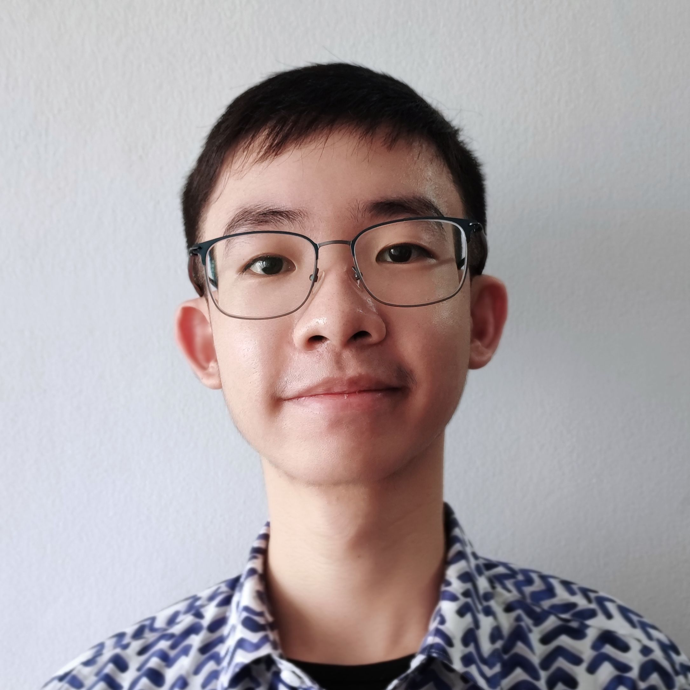
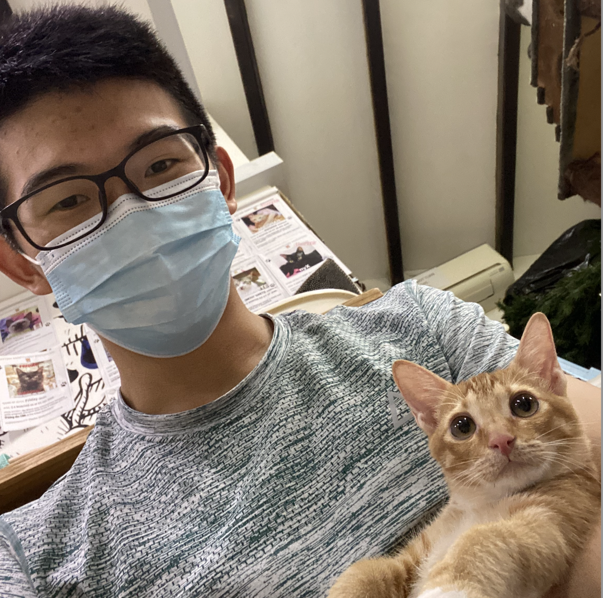
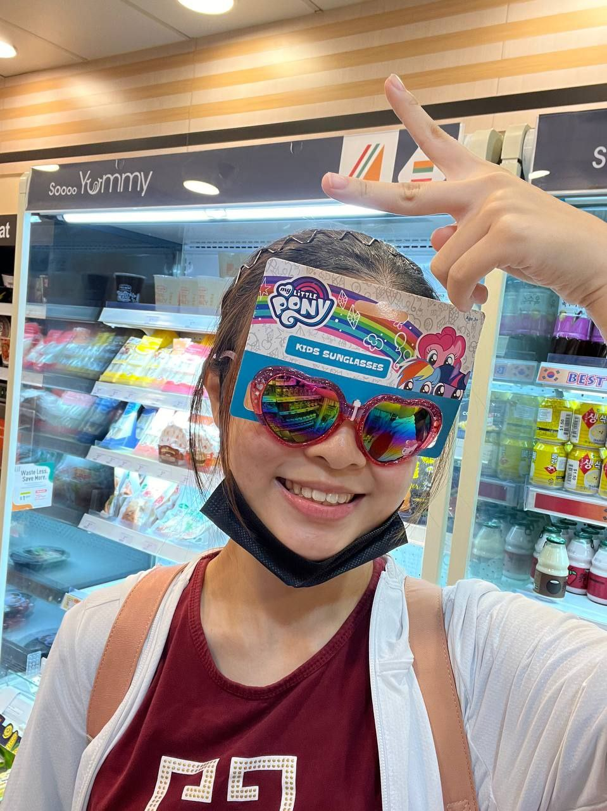

We are a team based in the [School of Computing, National University of Singapore](http://www.comp.nus.edu.sg).

You can reach us at the email `jason.qiu@u.nus.edu`

## Project team

### Jason Qiu

[[github](https://github.com/jasonqiu212)]
[[portfolio](team/jasonqiu212.md)]

* Role: Team lead
* Responsibilities: UI

### Pontakorn Prasertsuk

[[github](http://github.com/peppapighs)]
[[portfolio](team/peppapighs.md)]

* Role: Code Quality
* Responsibilities: UI

### Shenyi Cui

[[github](http://github.com/shenyicui)] [[portfolio](team/shenyicui.md)]

* Role: Deliverables
* Responsibilities: Issues

### Muthukrishnan Santosh

[[github](http://github.com/santosh3007)]
[[portfolio](team/santosh3007.md)]

* Role: Documentation
* Responsibilities: Manage Non-Functional Requirements

### Chin Yun Ru

[[github](http://github.com/yunruu)]
[[portfolio](team/yunruu.md)]

* Role: Integration
* Responsibilities: Glossary
