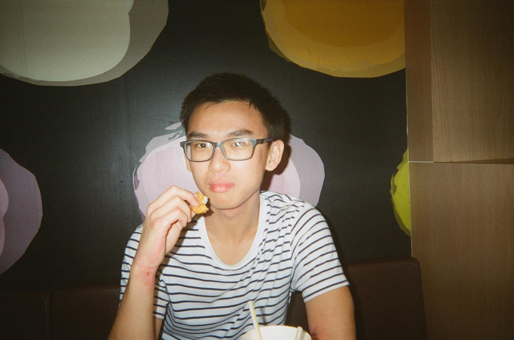
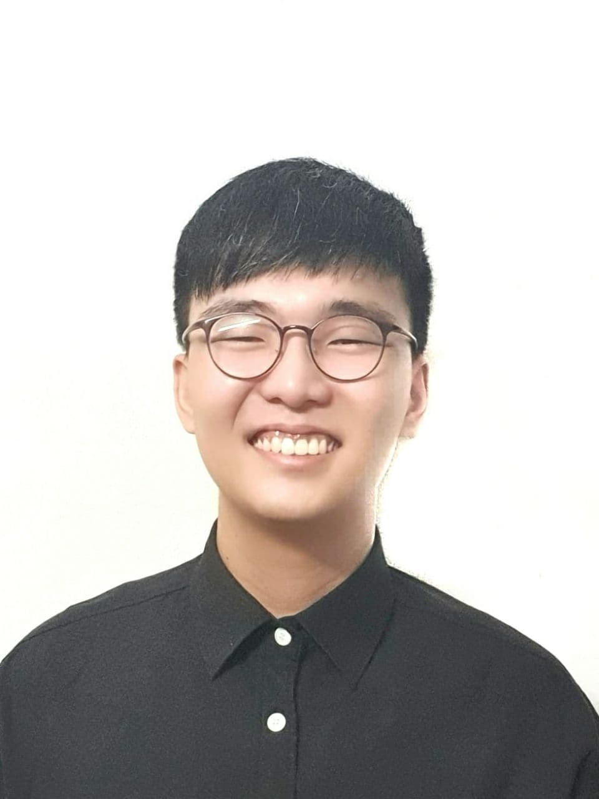
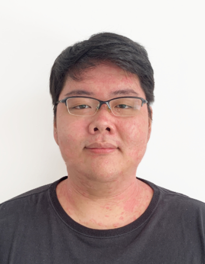
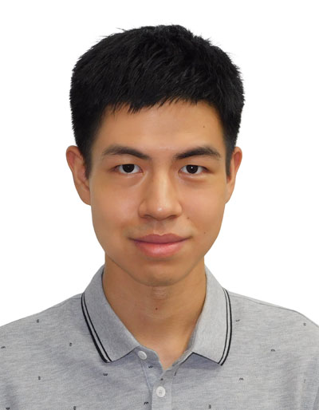

We are a team based in the [School of Computing, National University of Singapore](http://www.comp.nus.edu.sg).

## Project team

### Darren Teo

[[github](https://github.com/darrentde)]

[[portfolio](team/darrentde.md)]

* Role: Developer

### Chua Ming Quan

[[github](https://github.com/https://github.com/mqchua)]
[[portfolio](team/mqchua.md)]

* Role: Developer

### Tin En Hao

[[github](https://github.com/tinenhao)]
[[portfolio](team/tinenhao.md)]

* Role: Developer

### Justin Widodo

[[github](https://github.com/GenFusion122)]
[[portfolio](team/GenFusion122.md)]

* Role: Developer
* Responsibilities: Development

### Luo Tian You

[github](https://github.com/HakkaNgin)

[portfolio](team/HakkaNgin.md)

* Role: Developer
* Responsibilities: Development

