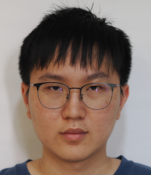
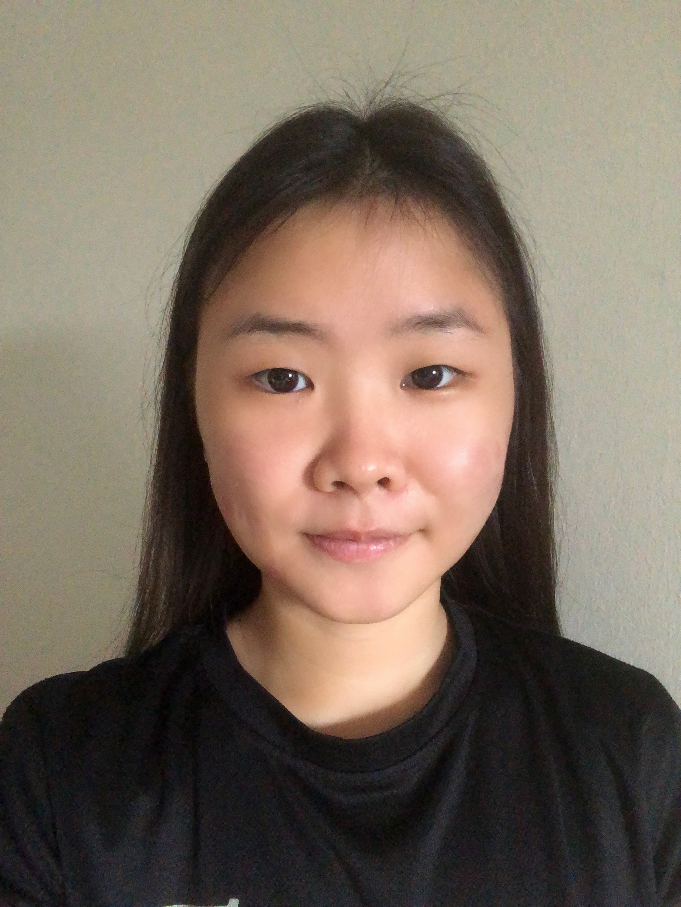

We are a team based in the [School of Computing, National University of Singapore](http://www.comp.nus.edu.sg).

You can reach us at the email `seer[at]comp.nus.edu.sg`

## Project team

### Douglas Lim

[[github](https://github.com/dlimyy)]
[[portfolio](team/dlimyy.md)]

* Role: Developer
* Responsibilities: Integration, Deliverables and deadlines

### Jane Doe

[[github](http://github.com/johndoe)]
[[portfolio](team/johndoe.md)]

* Role: Team Lead
* Responsibilities: UI

### Tan Li Xin

[[github](http://github.com/tlx02)] 
[[portfolio](team/tlx02.md)]

* Role: Developer
* Responsibilities: Code Quality

### Jean Doe

[[github](http://github.com/johndoe)]
[[portfolio](team/johndoe.md)]

* Role: Developer
* Responsibilities: Dev Ops + Threading

### James Doe

[[github](http://github.com/johndoe)]
[[portfolio](team/johndoe.md)]

* Role: Developer
* Responsibilities: UI
