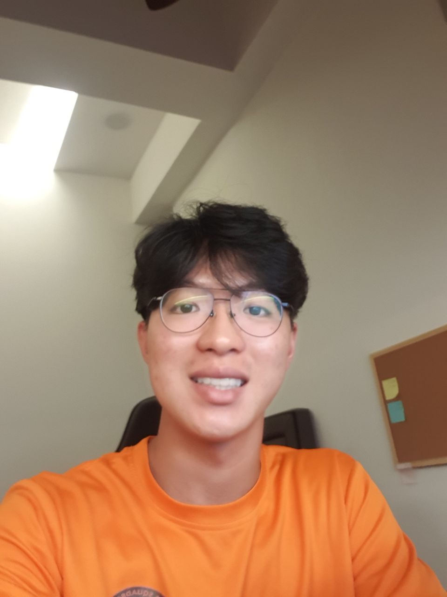
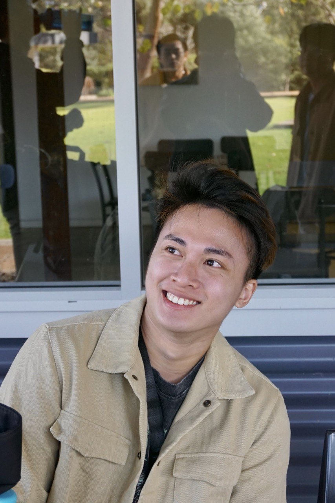
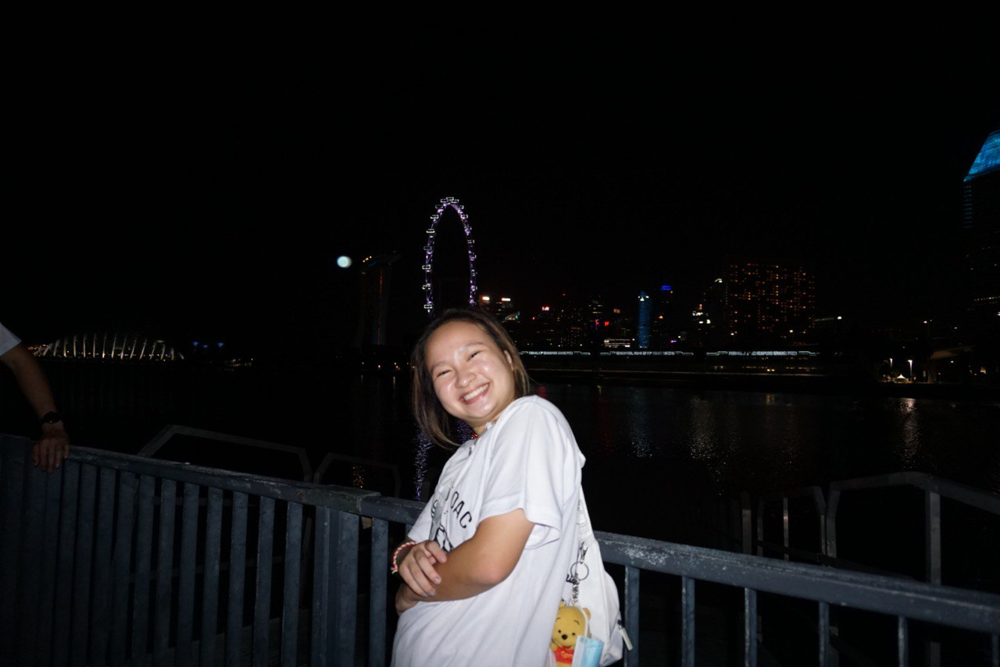
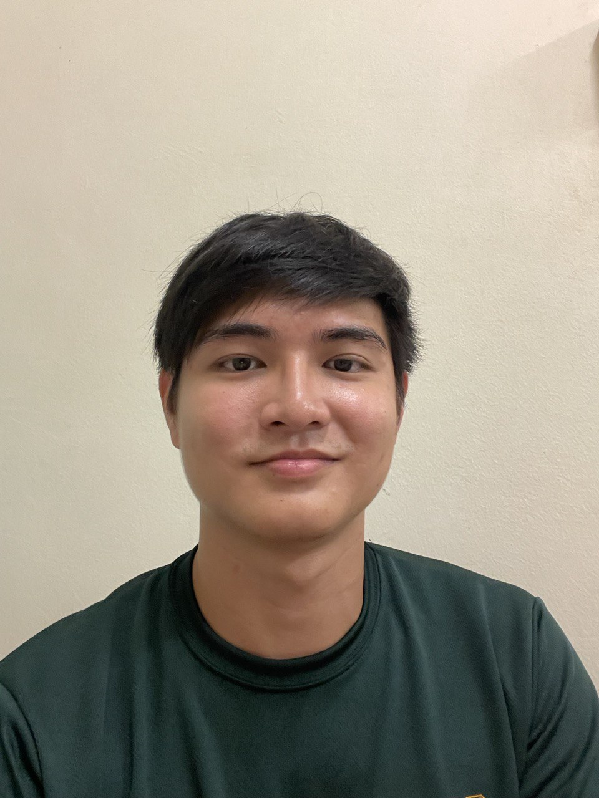
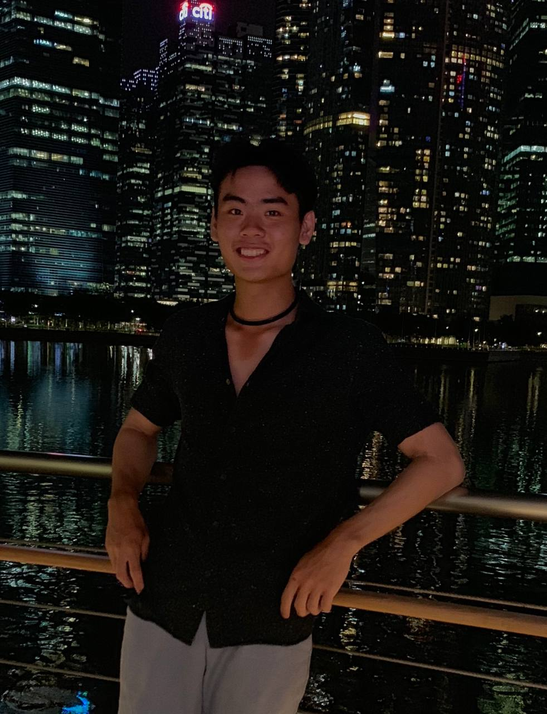

We are a team based in the [School of Computing, National University of Singapore](http://www.comp.nus.edu.sg).

## Project team
ConnectNUS
### Silas Tay

[[github](https://github.com/silastsl)]
[[portfolio](team/silastsl.md)]

* Role: Developer
* Responsibilities: Add modules to contacts, `Undo`/`Redo`

### Koh Rui Jie

[[github](http://github.com/rjkoh)]
[[portfolio](team/rjkoh.md)]

* Role: Developer
* Responsibilities: Add modules to contacts, add lesson to user/contact (`lesson` command),  add lesson to user/contact (`remove` command), view user/contact timetable (`timetable` command)

### Laura Lee

[[github](http://github.com/leehuiyulaura)]
[[portfolio](team/leehuiyulaura.md)]

* Role: Developer
* Responsibilities: v1.2 UI, `filter` command, convert current mods to previous mod (`nextsem` command)

### Shamus Tan

[[github](http://github.com/shamooose)]
[[portfolio](team/shamooose.md)]

* Role: Developer
* Responsibilities: Add user (`user` command), edit user or contact modules (`module` command), add GitHub link, view modules left (`modulesleft` command)

### Linus Chui

[[github](http://github.com/linuschui)]
[[portfolio](team/linuschui.md)]

* Role: Developer
* Responsibilities: v1.2 testing, add lesson to user/contact (`lesson` command),  add lesson to user/contact (`remove` command), view user/contact timetable (`timetable` command)
