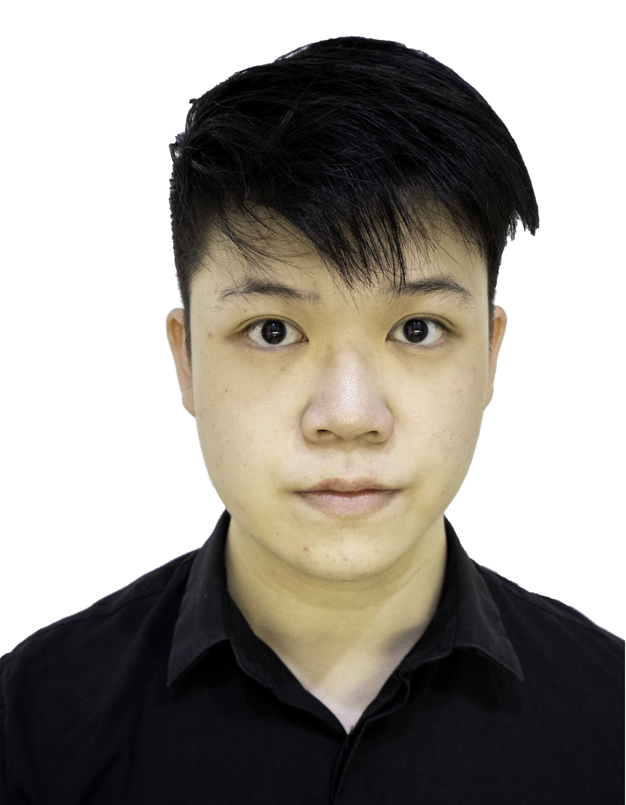
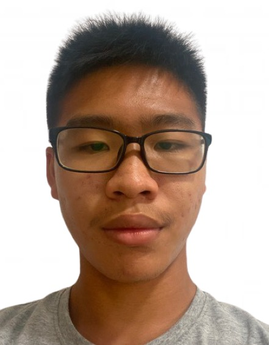
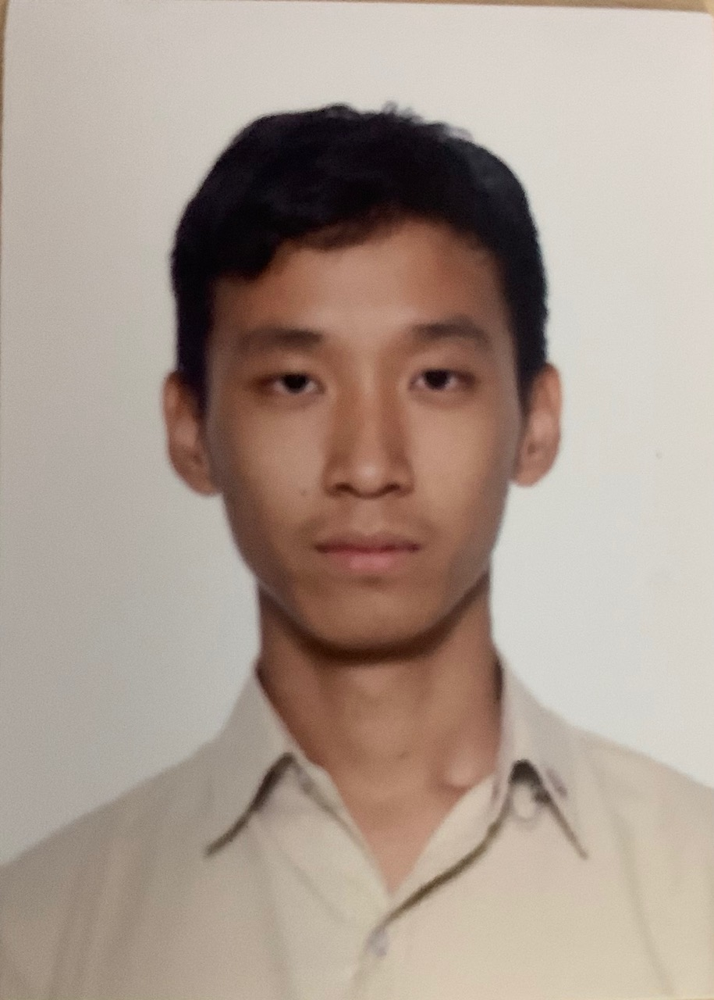

We are a team based in the [School of Computing, National University of Singapore](http://www.comp.nus.edu.sg).

You can reach us at the email `seer[at]comp.nus.edu.sg`

## Project team

### John Doe

[[homepage](http://www.comp.nus.edu.sg/~damithch)]
[[github](https://github.com/johndoe)]
[[portfolio](team/johndoe.md)]

* Role: Project Advisor
### Kok Chun Khai

[[github](http://github.com/avock)]
[[portfolio](team/avock.md)]

* Role: Team Lead
* Responsibilities: UI

### Xu Daofu

[[github](https://github.com/therealdaofu)] [[portfolio](team/therealdaofu.md)]

* Role: Developer

### Sun Yu Ting

[[github](http://github.com/effixion)]
[[portfolio](team/effixion.md)]

* Role: Developer
* Responsibilities: to be added soon

### Li Yingming

[[github](http://github.com/Yingming23)]
[[portfolio](team/yingming23.md)]

* Role: Developer
* Responsibilities: To be Added
