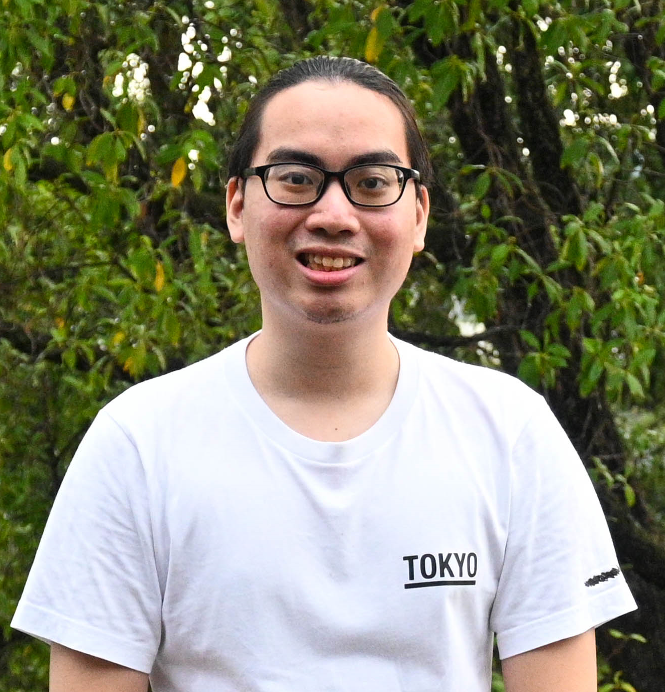
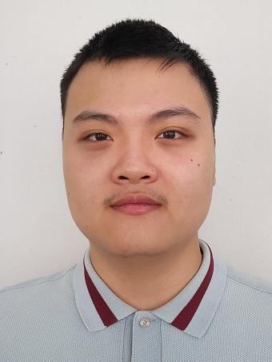
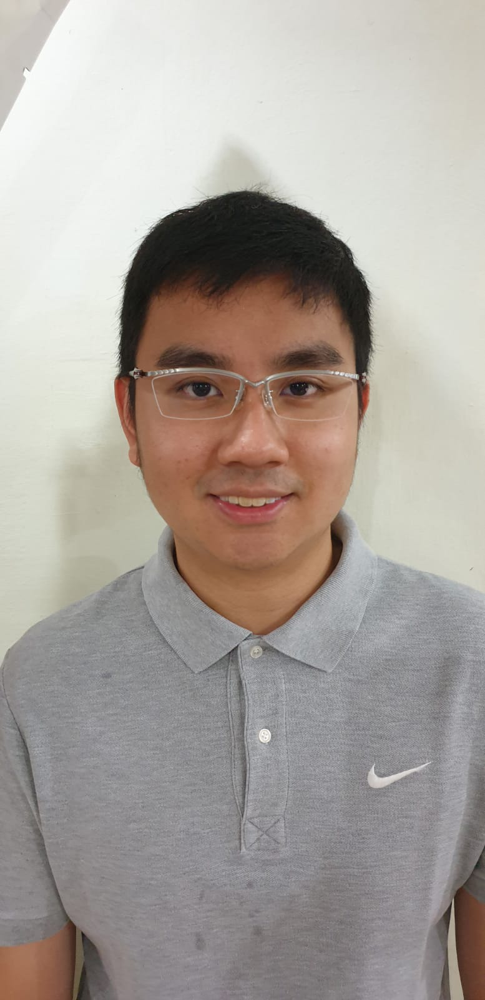
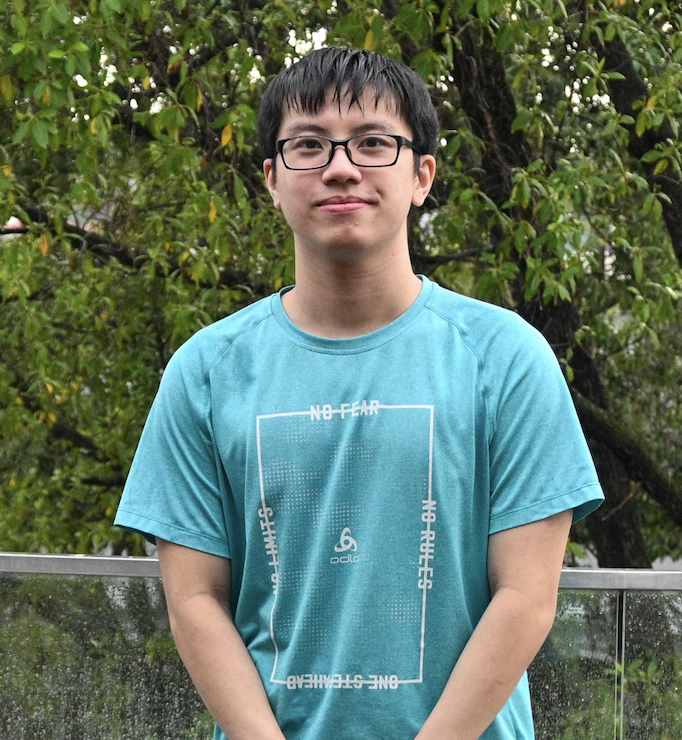

We are a team based in the [School of Computing, National University of Singapore](http://www.comp.nus.edu.sg).

You can reach us at the email `seer[at]comp.nus.edu.sg`

## Project team

### Shum Jie Hui

[[github](https://github.com/ShummyOwnzYou)]
[[portfolio](team/jiehui.md)]

* Role: Developer
* Responsibilities: Documentation + Integration + Testing

### Samuel Cheong

[[github](https://github.com/samuelcheongws/)]
[[portfolio](team/samuelcheonws.md)]

* Role: Team Member
* Responsibilities: Integration + Testing + Scheduling

### Liu Yijun

[[github](https://github.com/L1uY1jun)]
[[portfolio](team/l1uy1jun.md)]

* Role: Team Leader
* Responsibilities: Code Quality + Documentation + Deliverables & Deadlines

### Darren Tng

[[github](https://github.com/DarrenCsAcc)]
[[portfolio](team/darrencsacc.md)]

* Role: Developer
* Responsibilities: Documentation

### Benjy Tan

[[github](https://github.com/benjytan45678)]
[[portfolio](team/benjytan45678.md)]

* Role: Developer
* Responsibilities: Documentation + Testing + UI
