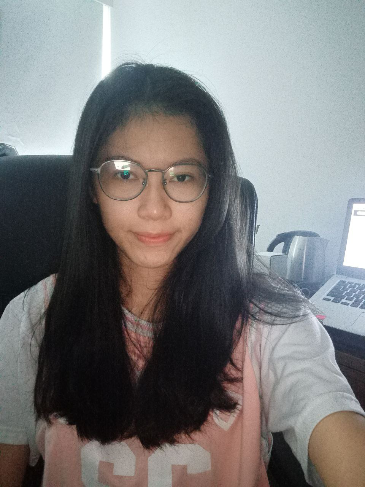
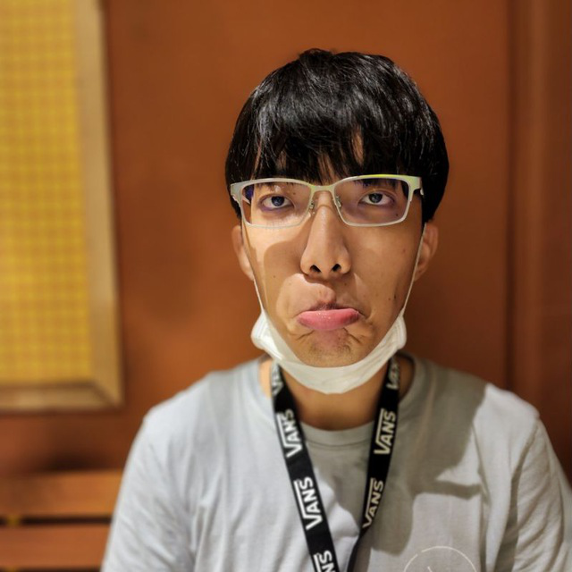

We are a team based in the [School of Computing, National University of Singapore](http://www.comp.nus.edu.sg).

You can reach us at the email `peiyee88@nus.edu.sg` or `xxxxx@nus.edu.sg`

## Project team

### Pei Yee Cheng

[[github](https://github.com/peiyee88)]
[[portfolio](team/peiyee88.md)]

* Role: Developer

<<<<<<< HEAD
### Kartikeya -
=======
### Kartikeya - 
>>>>>>> d746cc7 (Update AboutUs with personal details)

([github](http://github.com/kxrt))
<<<<<<< HEAD
([portfolio](team/kxrt.md))
=======
([portfolio](team/kartikeya.md))
>>>>>>> d746cc7 (Update AboutUs with personal details)

* Role: Developer

### Zhehao

([github](http://github.com/Charles1026))
[[portfolio](team/charles1026.md)]

* Role: Developer

### Jean Doe

[[github](http://github.com/johndoe)]
[[portfolio](team/johndoe.md)]

* Role: Developer
* Responsibilities: Dev Ops + Threading

### James Doe

[[github](http://github.com/johndoe)]
[[portfolio](team/johndoe.md)]

* Role: Developer
* Responsibilities: UI
