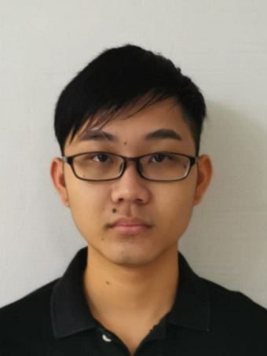
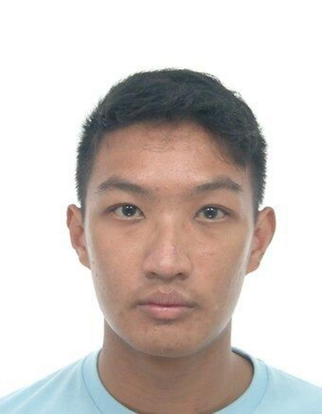
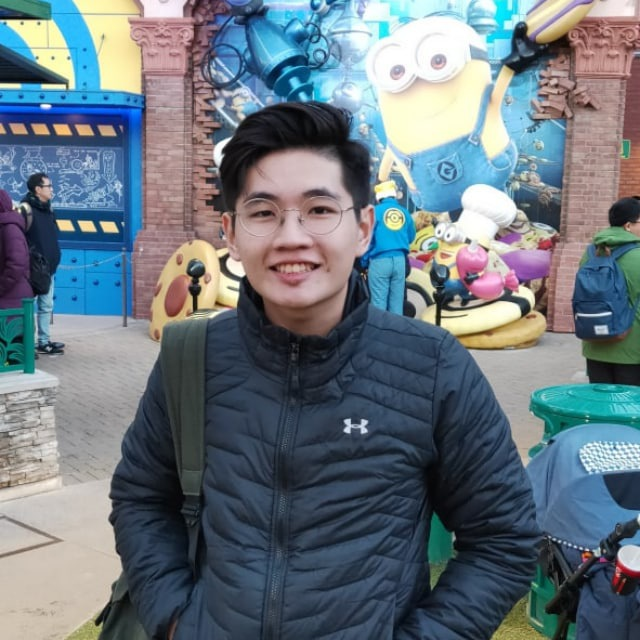
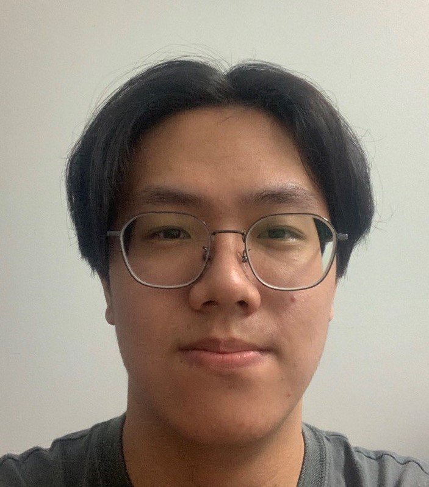

We are a team based in the [School of Computing, National University of Singapore](http://www.comp.nus.edu.sg).

You can reach us at the email `seer[at]comp.nus.edu.sg`

## Project team

### Jordan Quah

[[github](https://github.com/jq1836)]
[[portfolio](team/jq1836.md)]

* Role: Team Lead
* Responsibilities: Scheduling and tracking

### Alvin Jiang

[[github](http://github.com/alvinjiang1)]
[[portfolio](team/alvinjiang1.md)]

* Role: Developer
* Responsibilities: Documentation

### Naren Sreekanth

[[github](http://github.com/nareus)]
[[portfolio](team/nareus.md)]

* Role: Developer
* Responsibilities: Testing

### Neale Tham

[[github](http://github.com/nealetham)]
[[portfolio](team/nealetham.md)]

* Role: Developer
* Responsibilities: Deliverables and deadlines + Integration

### Nicholas Seah

[[github](http://github.com/nseah21)]
[[portfolio](team/nseah21.md)]

* Role: Developer
* Responsibilities: Code Quality
