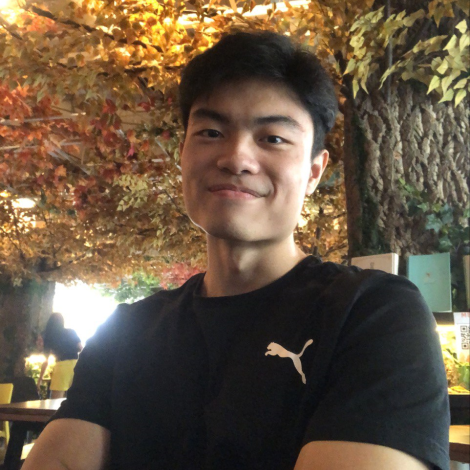
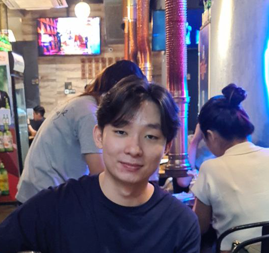
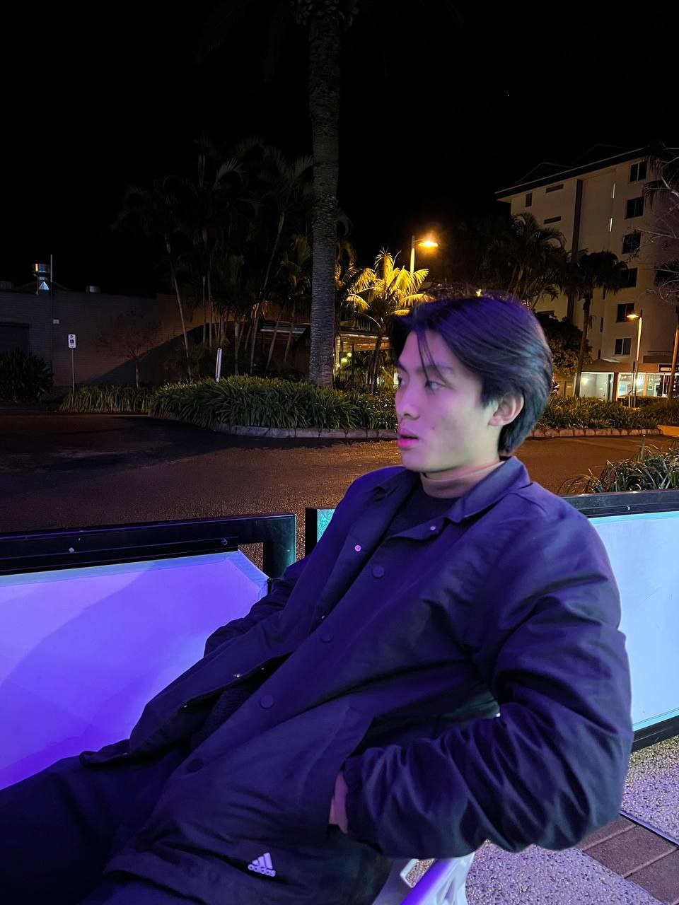
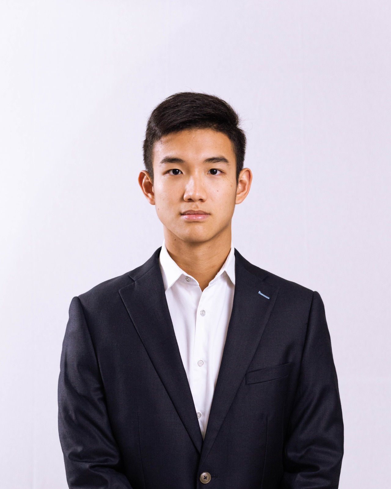

We are a team based in the [School of Computing, National University of Singapore](http://www.comp.nus.edu.sg).

You can reach us at the email `seer[at]comp.nus.edu.sg`

## Project team

### Daryl Chua

[[github](https://github.com/rylzxc)]
[[portfolio](team/rylzxc.md)]

* Role: Team Lead
* Responsibilities: Overall project coordination, deliverables and deadlines

### Adee Aryaa

[[github](http://github.com/adeearyaa)]
[[portfolio](team/adeearyaa.md)]

* Role: Code Quality
* Responsibilities: Ensures that Code follows a common style and achieves maximum readability

### Glemen Neo

[[github](http://github.com/glemenneo)] [[portfolio](team/glemenneo.md)]

* Role: UI/UX
* Responsibilities: Designing and implementing UI elements for new features, improving user experience by redesigning existing UI elements.

### Jacob Kwan

[[github](http://github.com/jacobkwan)]
[[portfolio](team/jacobkwan.md)]

* Role: Integration
* Responsibilities: Versioning of codebase/releases and overall maintenance of the repository.

### Tien Yu

[[github](http://github.com/tienyu2000)]
[[portfolio](team/tienyu2000.md)]

* Role: Documentation
* Responsibilities: JavaDocs to generate API documentation in HTML format
