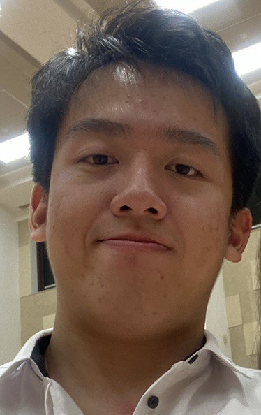
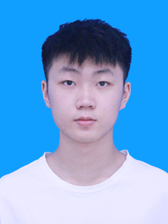
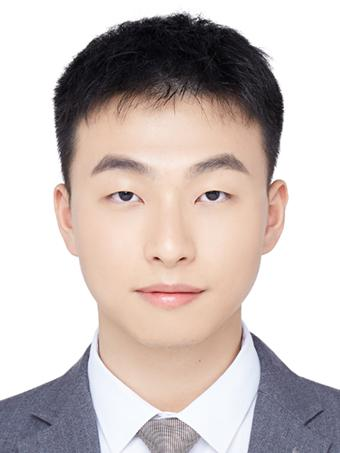

We are a team based in the [School of Computing, National University of Singapore](http://www.comp.nus.edu.sg).

You can reach us at the email `seer[at]comp.nus.edu.sg`

## Project team

### Guok Wei Jie

[[github](https://github.com/guokweijie)]
[[portfolio](team/guokweijie.md)]

* Role: Team Lead

### Fu Zanwen

[[github](http://github.com/fuzanwenn)]

* Role: Documentation
* Responsibilities: the quality of various project documents

### Li Tianze

[[github](http://github.com/tzl0)]
[[portfolio](team/tzl0.md)]

* Role: Developer
* Responsibilities: Data

### Jean Doe

[[github](http://github.com/johndoe)]
[[portfolio](team/johndoe.md)]

* Role: Developer
* Responsibilities: Dev Ops + Threading

### James Doe

[[github](http://github.com/johndoe)]
[[portfolio](team/johndoe.md)]

* Role: Developer
* Responsibilities: UI
