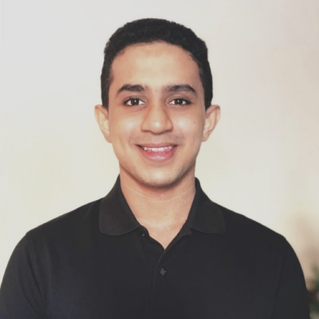
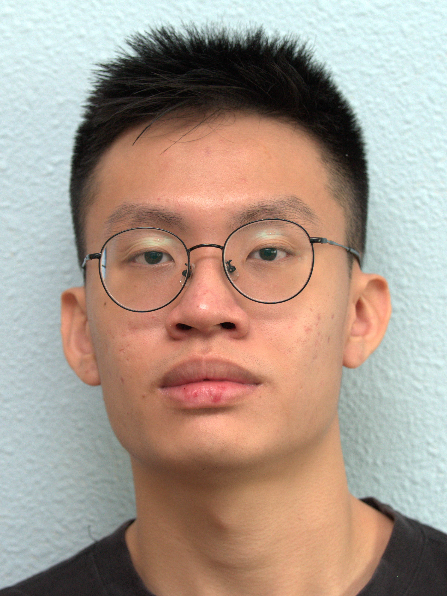
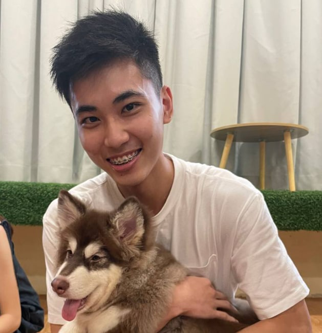
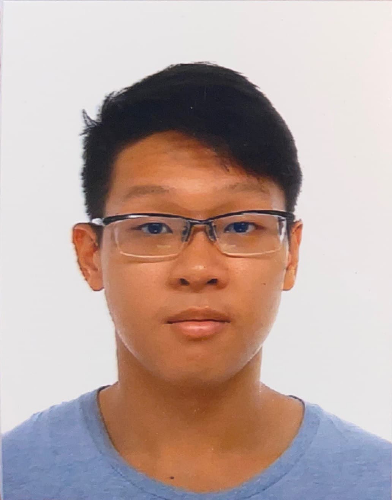

We are a team based in the [School of Computing, National University of Singapore](http://www.comp.nus.edu.sg).

## Project team

### Shashank Acharya

[[github](https://github.com/sheshenk)][[portfolio](team/sheshenk.md)]

* Role: Admin

### Shen Xinbei

[[github](https://github.com/ichigh0st)][[portfolio](team/ichigh0st.md)]

* Role: Code quality

### Lester Ong

[[github](http://github.com/lesterong)][[portfolio](team/lesterong.md)]

* Role: Developer

### Shawn Chew

[[github](https://github.com/shawnchew)][[portfolio](team/shawnchew.md)]

* Role: Developer

### Kee Seow Han

[[github](http://github.com/KSHan29)][[portfolio](team/kshan29.md)]

* Role: Testing

