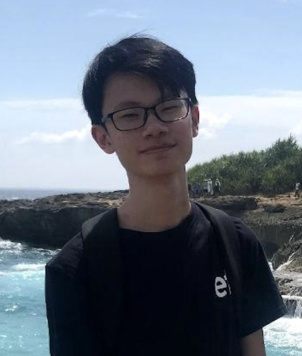
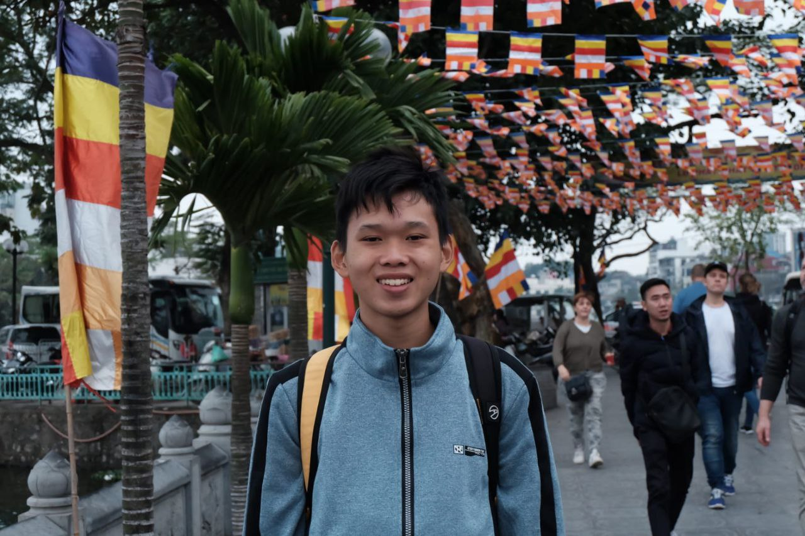
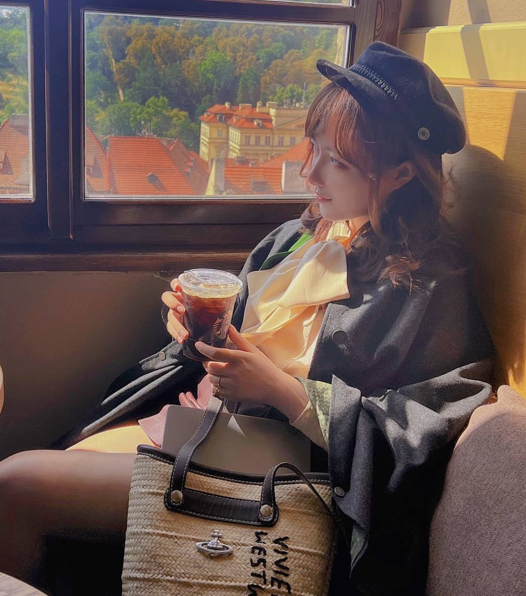
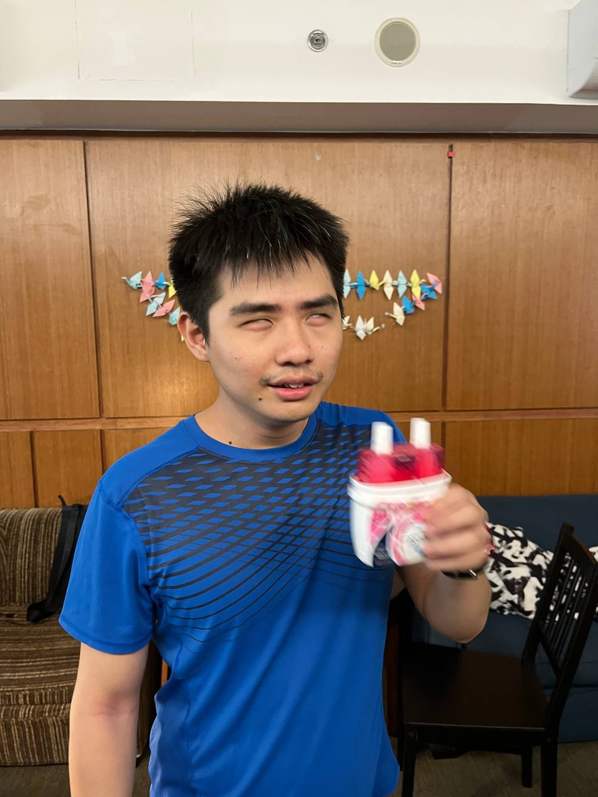
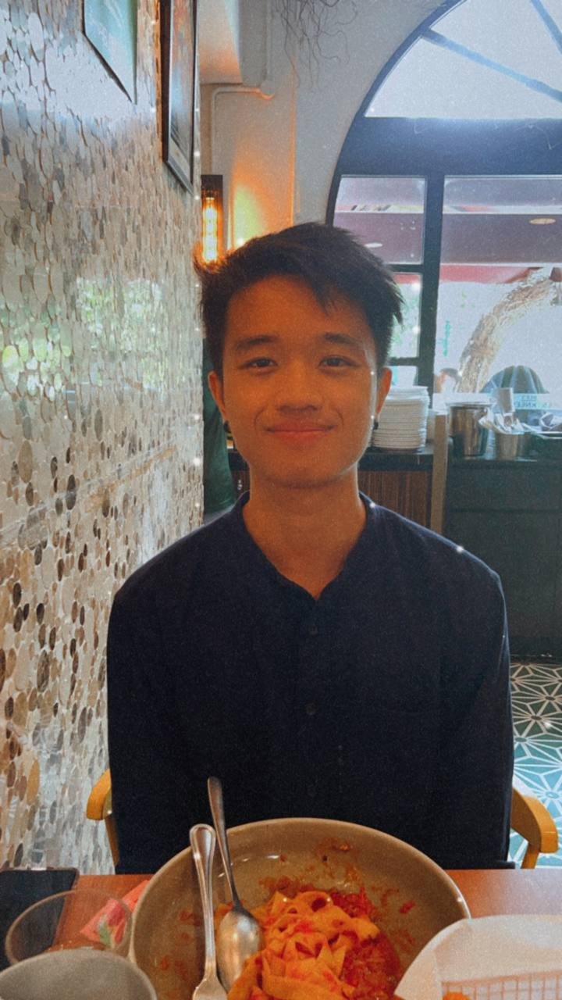

We are a team based in the [School of Computing, National University of Singapore](http://www.comp.nus.edu.sg).

You can reach us at the email `seer[at]comp.nus.edu.sg`

## Project team

### Zacchaeus Chok

[[github](https://github.com/zacchaeuschok)]
[[portfolio](team/zacchaeuschok.md)]

* Role: Code Zebra
* Responsibilities: Generate code + testing + documentation

### Sng Haoren

[[github](http://github.com/misterpuffin)]
[[portfolio](team/misterpuffin.md)]

* Role: Code Monkey
* Responsibilities: Generate code

### Zhao Yige

[[github](http://github.com/frrramses)] [[portfolio](team/frrramses.md)]

* Role: Code Crocodile
* Responsibilities: Random Ideas & Random Codes

### Kang Yue Hern

[[github](http://github.com/yuehernkang)]
[[portfolio](team/yuehernkang.md)]

* Role: Developer
* Responsibilities: Dev Ops + Threading

### Lee Kang Wei

[[github](http://github.com/lkwlkww)]
[[portfolio](team/lkwlkww.md)]

* Role: Developer
* Responsibilities:
    * Client directory features
    * Ensure good code quality
