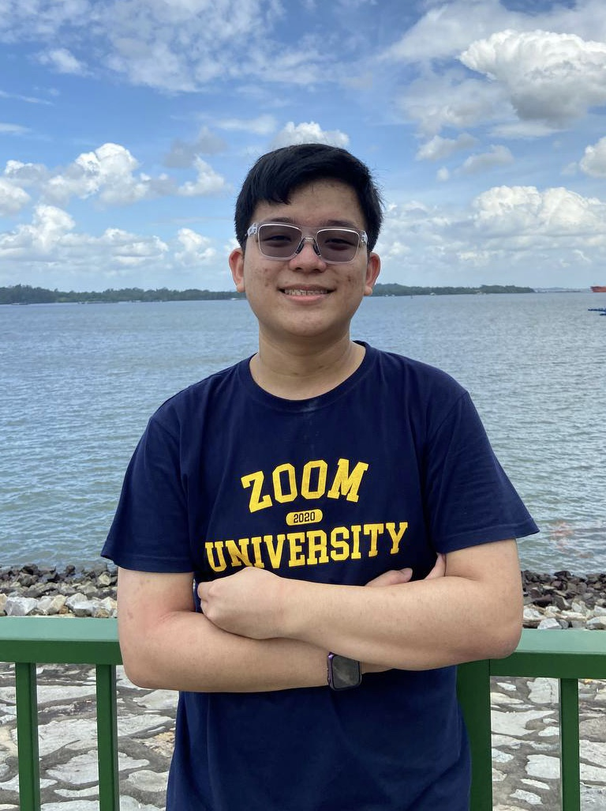
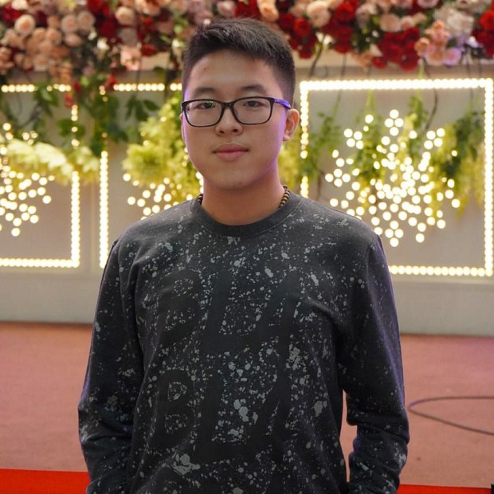
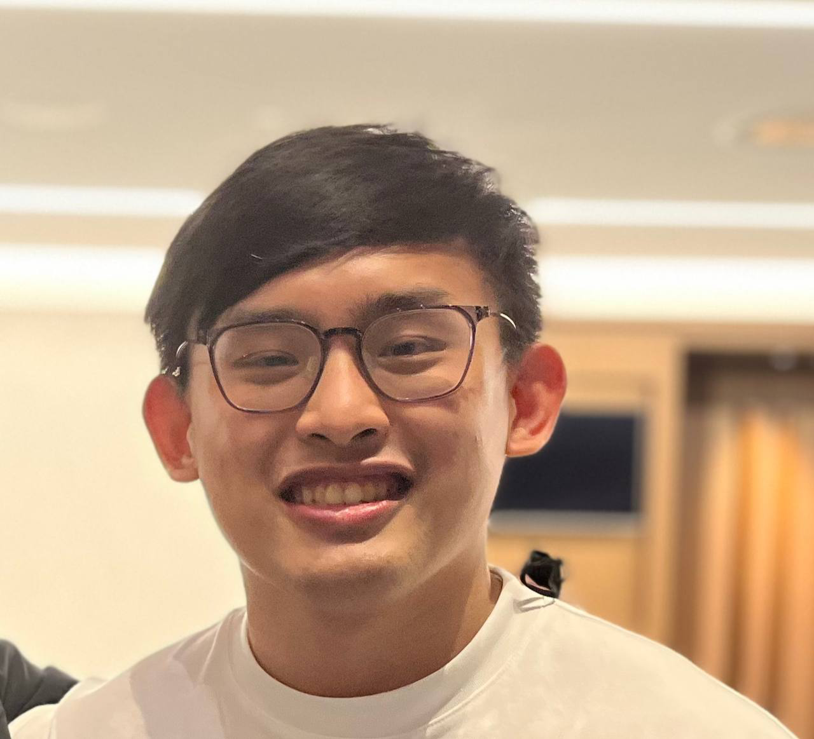
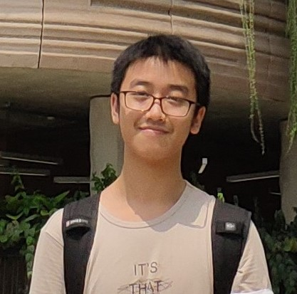
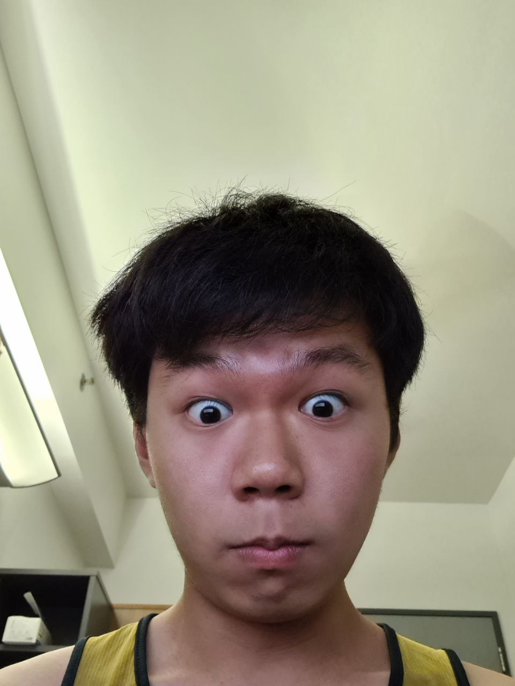

We are a team based in the [School of Computing, National University of Singapore](http://www.comp.nus.edu.sg).

You can reach us at the email `seer[at]comp.nus.edu.sg`

## Project team

### Leong Ming Jian Eugene

[[github](https://github.com/eugenelmj)]
[[portfolio](team/eugenelmj.md)]

* Role: Project Advisor
* Responsibilities: Meeting Minutes

### Nicholas Russell Saerang

[[github](http://github.com/russelldash332)]
[[portfolio](team/russelldash332.md)]

* Role: Team Lead
* Responsibilities: UI

### Chua Yu Xuan Jordan 

[[github](http://github.com/jordanchua)]
[[portfolio](team/jordanchua.md)]

* Role: Developer
* Responsibilities: Data

### Zhang Yuhao

[[github](http://github.com/YH-15)]
[[portfolio](team/yh-15.md)]

* Role: Developer
* Responsibilities: Storage

### Jean Doe

[[github](http://github.com/johndoe)]
[[portfolio](team/johndoe.md)]

* Role: Developer
* Responsibilities: Dev Ops + Threading

### Poh Yu Jie

[[github](http://github.com/PokezardVGC)]
[[portfolio](team/pokezardvgc.md)]

* Role: Developer
* Responsibilities: UI
