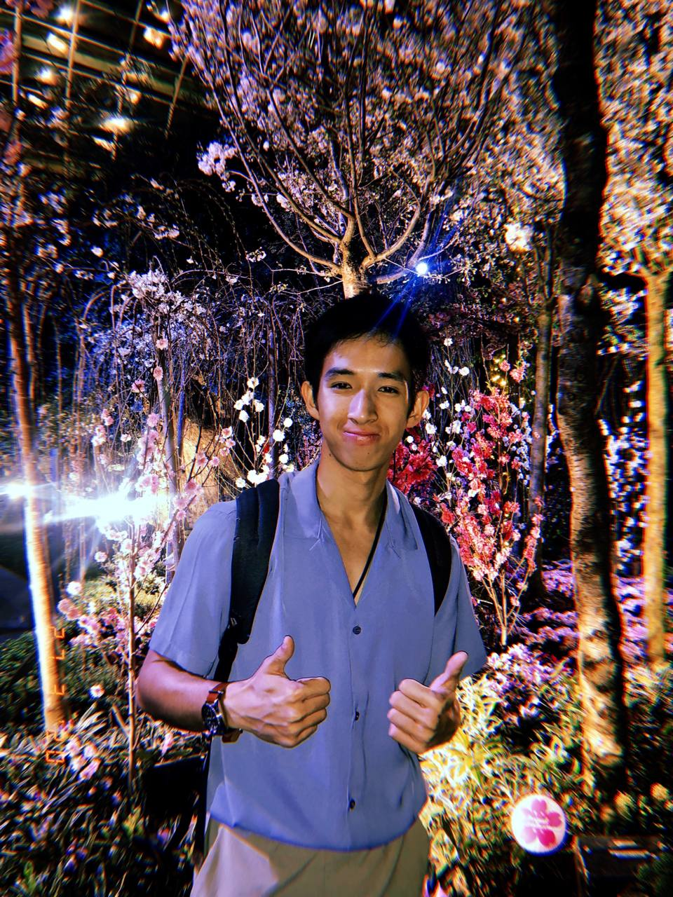
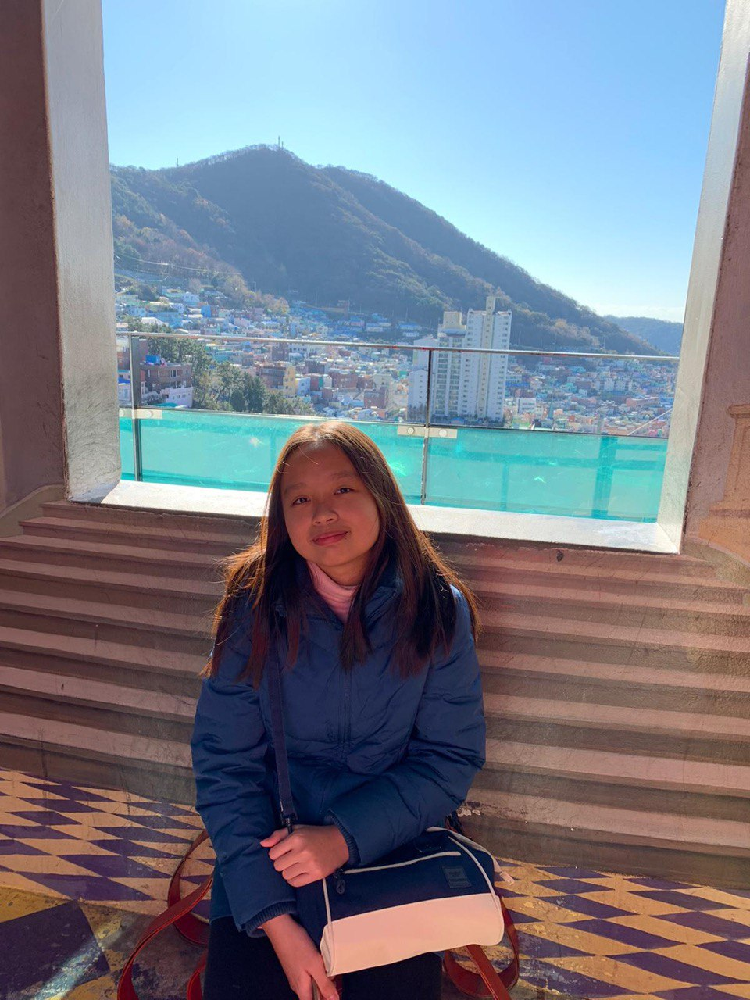
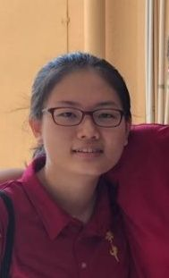
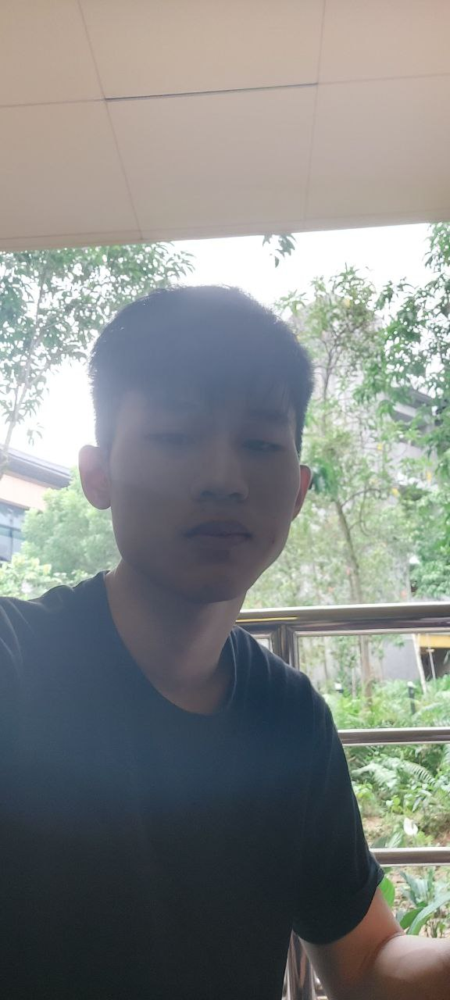
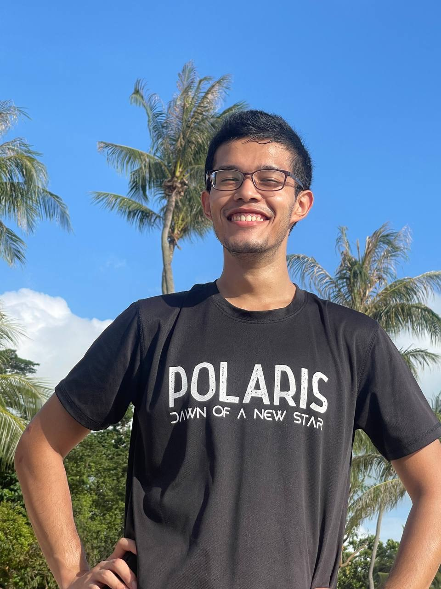

We are a team based in the [School of Computing, National University of Singapore](http://www.comp.nus.edu.sg)!

We are developing NutriGoals - a free-to-use CLI nutritional tracker for beginners who are getting started on their fitness journey!

## Project team

### Xavier Ong

[[GitHub](https://github.com/xav168)][[Portfolio](team/xav168.md)]

* Role: Developer
* Responsibilities: Assigning issues

### Nicole Lim

[[GitHub](http://github.com/nicolelim02)][[Portfolio](team/nicolelim02.md)]

* Role: Developer
* Responsibilities: Code Quality

### Tin Ruiqi

[[GitHub](http://github.com/ruiqi7)][[Portfolio](team/ruiqi7.md)]

* Role: Developer
* Responsibilities: Deliverables and deadline

### Tan Ping Zhi

[[GitHub](https://github.com/TanPingZhi)][[Portfolio](team/tanpingzhi.md)]

* Role: Developer
* Responsibilities: Integration

### Aung Khant Kyaw

[[GitHub](http://github.com/akkfiros)][[Portfolio](team/akkfiros.md)]

* Role: Developer
* Responsibilities: Documentation
