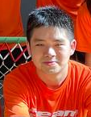
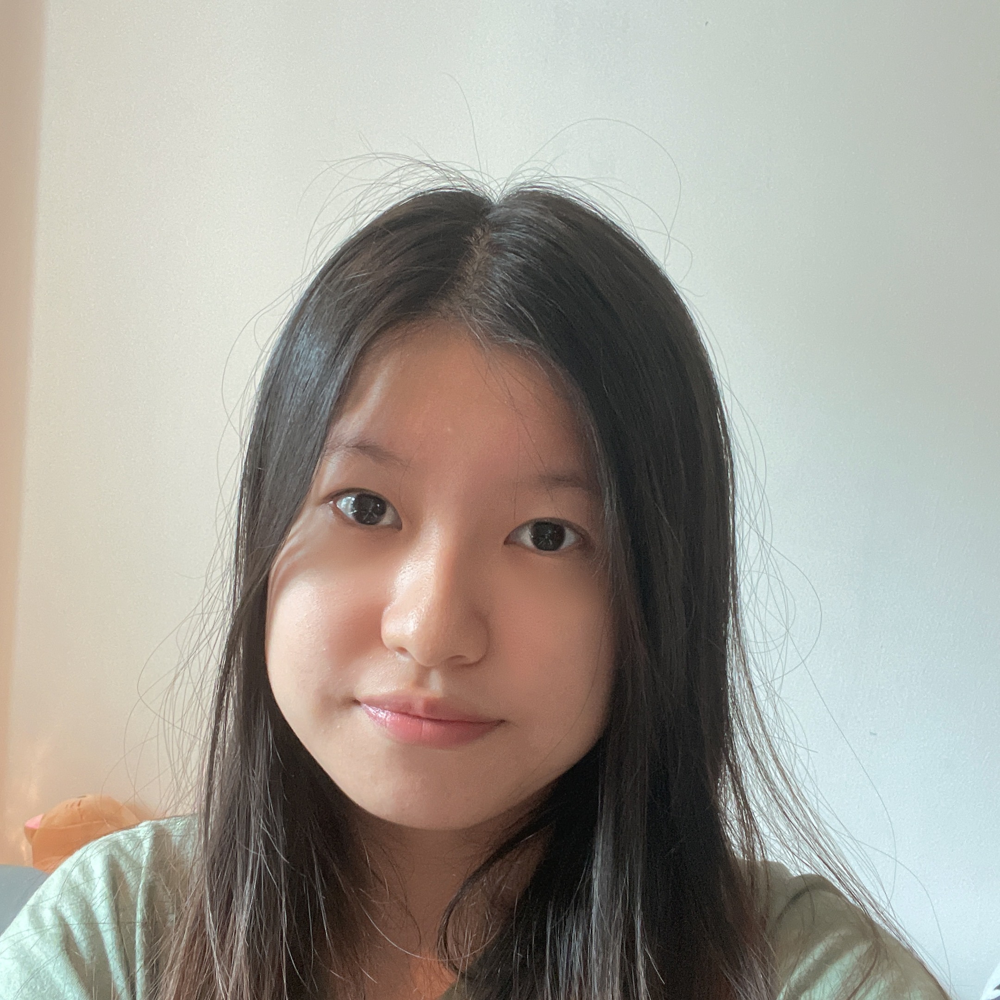
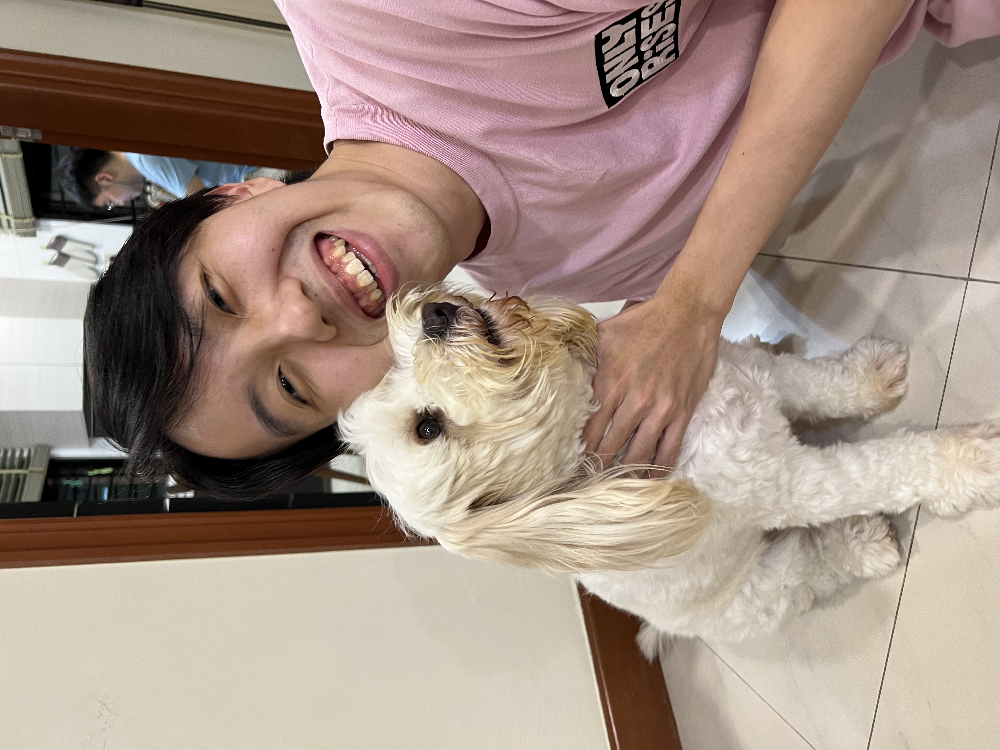

We are a team based in the [School of Computing, National University of Singapore](http://www.comp.nus.edu.sg).

You can reach us at the email `seer[at]comp.nus.edu.sg`

## Project team

### Ong Wee Marcus

[[github](https://github.com/lfrostbytee)]
[[portfolio](team/lfrostbytee.md)]

* Role: Team Lead
* Responsibilities: Deliverables, Scheduling and Tracking

### Meng Qiaoran

[[github](http://github.com/Qiaoran-M)]
[[portfolio](team/qiaoran-m.md)]

* Role: Developer
* Responsibilities: Testing

### Benjamin Sim

[[github](https://github.com/Benjamin-Sim)]
[[portfolio](team/benjamin-sim.md)]

* Role: Developer
* Responsibilities: Code Quality

### Tan Hong Liang

[[github](http://github.com/tanhl2000)] [[portfolio](team/tanhl2000.md)]

* Role: Developer
* Responsibilities: Integration

### Vinod s/o Jaya Kumar

[[github](http://github.com/Vinodjayakumar124)]
[[portfolio](team/vinodjayakumar124.md)]

* Role: Developer
* Responsibilities: Documentation
