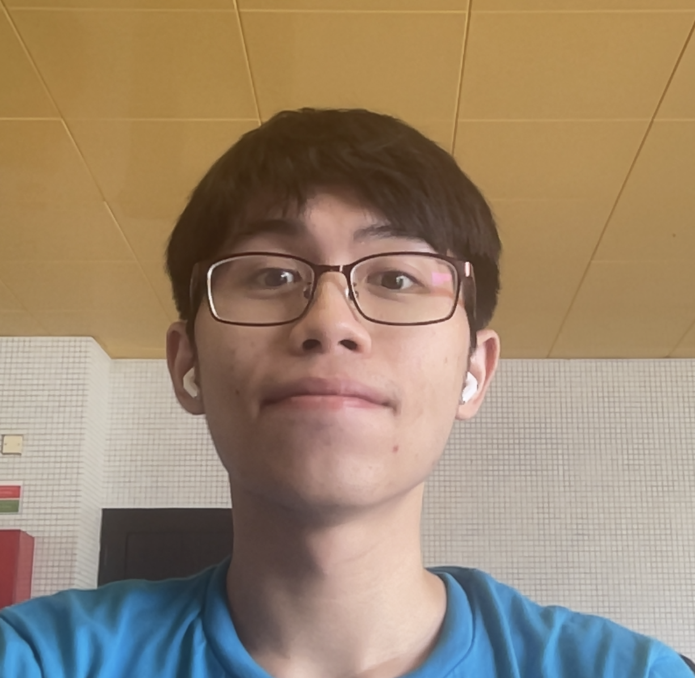
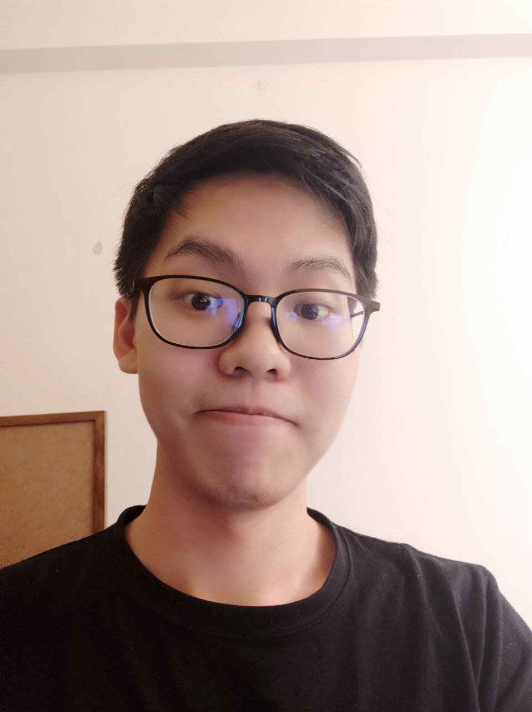
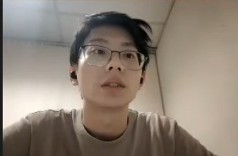
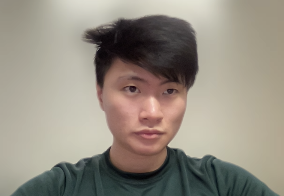
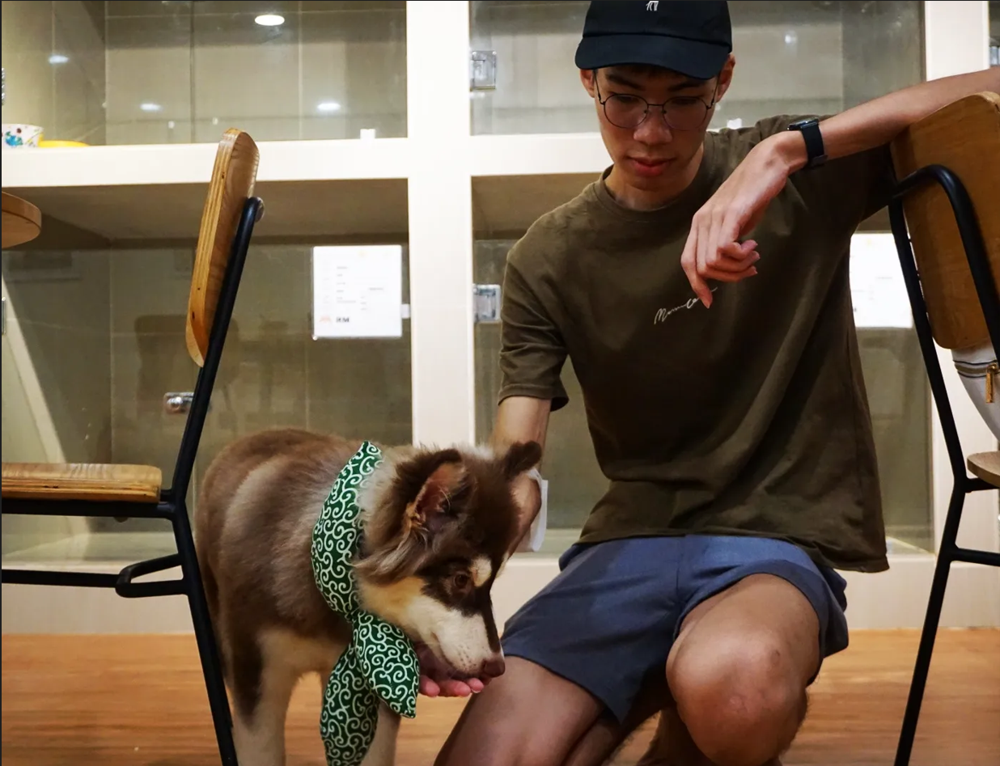

We are a team based in the [School of Computing, National University of Singapore](http://www.comp.nus.edu.sg).

You can reach us at the email `seer[at]comp.nus.edu.sg`

## Project team

### Sheyuan Yeo

[[github](https://github.com/Piyotato)]
[[portfolio](team/piyotato.md)]

* Role: Developer
* Responsibilities: [To Be Added]

### Silas Yeo

[[github](http://github.com/comicalromance)]
[[portfolio](team/johndoe.md)]

* Role: Developer
* Responsibilities: [To Be Added]

### Po Hsien

[[github](http://github.com/lpohsien)]
[[portfolio](team/lpohsien.md)]

* Role: Developer
* Responsibilities: [To Be Added]

### Lin Zizheng

[[github](http://github.com/dr-arrgghh)]
[[portfolio](team/dr-arrgghh.md)]

* Role: Developer
* Responsibilities: [To Be Added]

### Pang Bao Bin

[[github](http://github.com/highorbit25)]
[[portfolio](team/highorbit25.md)]

* Role: Developer
* Responsibilities: [To Be Added]
