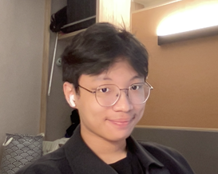
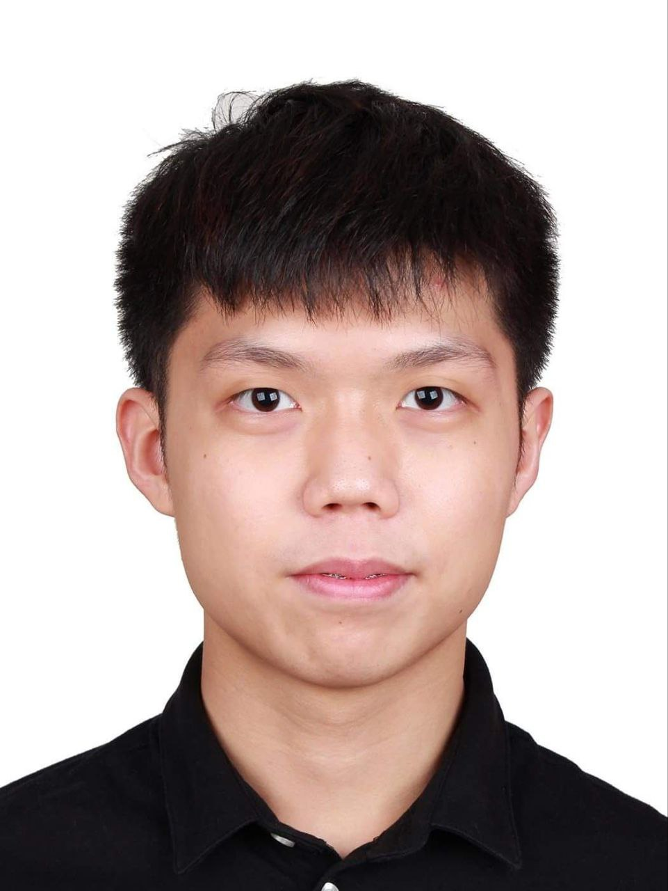
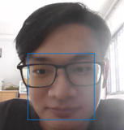
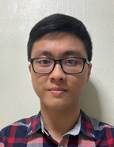

We are a team based in the [School of Computing, National University of Singapore](http://www.comp.nus.edu.sg).

We are a group of like-minded students who saw the problems financial advisors are facing in their work. We came together for the [CS2103T](https://nusmods.com/modules/CS2103T/software-engineering) module in NUS to create a create address book for financial advisors to build their client base.

## Project team

### Kelvin Ou

[[github](https://github.com/kelvinou01)]
[[portfolio](team/kelvinou01.md)]

- Role: Deliverables and deadlines, Scheduling and tracking
- Responsibilities: Defines and tracks deliverables and ensures that they are done correctly.

### Simpson Eng

[[github](http://github.com/craeyeons)]
[[portfolio](team/craeyeons.md)]

- Role: Testing Specialist, Documentation
- Responsibilities: Ensures components are properly tested and documented.

### Tan Ming Wei

[[github](http://github.com/malwaregarry)]
[[portfolio](team/malwaregarry.md)]

- Role: Code quality
- Responsibilities: Reviews code to ensure adherence to coding standards.

### Yap Zhi Heng

[[github](http://github.com/Polygonalr)]
[[portfolio](team/polygonalr.md)]

- Role: Team Lead, Frontend (JavaFX) Expert
- Responsibilities: Coordinates the project team and manages changes to the UI.

### Yew Wei Quan

[[github](http://github.com/weiquany)]
[[portfolio](team/weiquany.md)]

- Role: Deliverables and deadlines, Integration
- Responsibilities: Ensures deliverables are done on time and able to integrate together.
