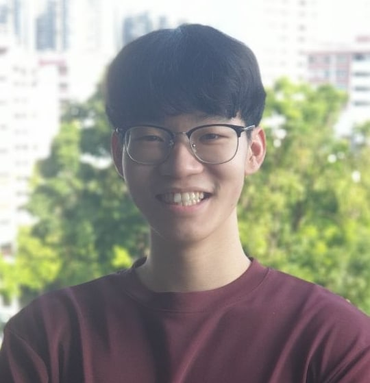
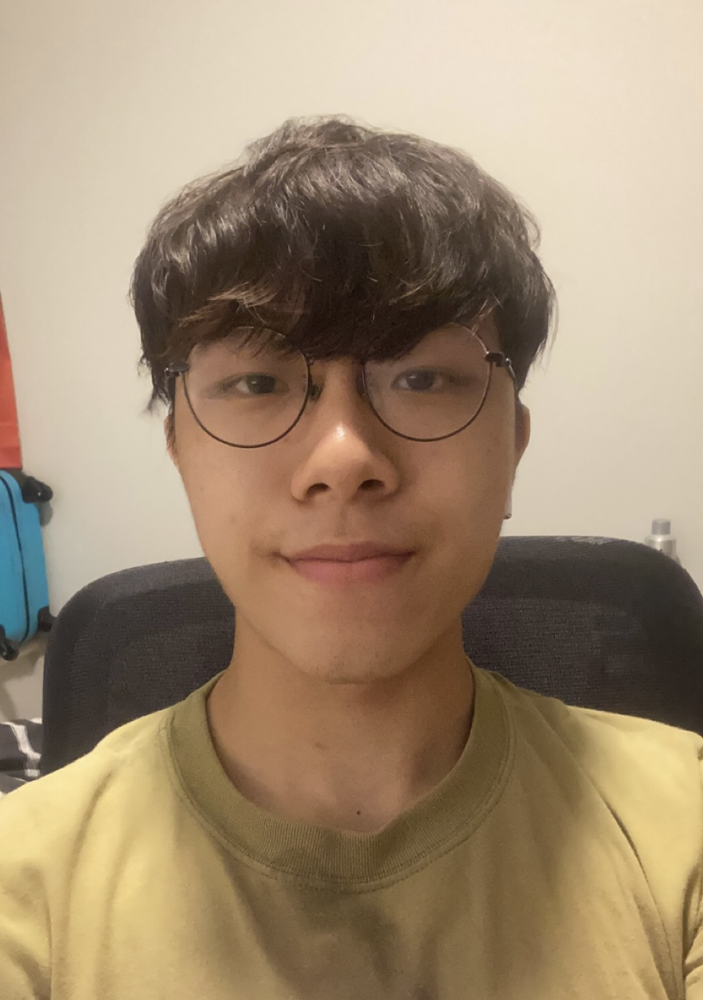
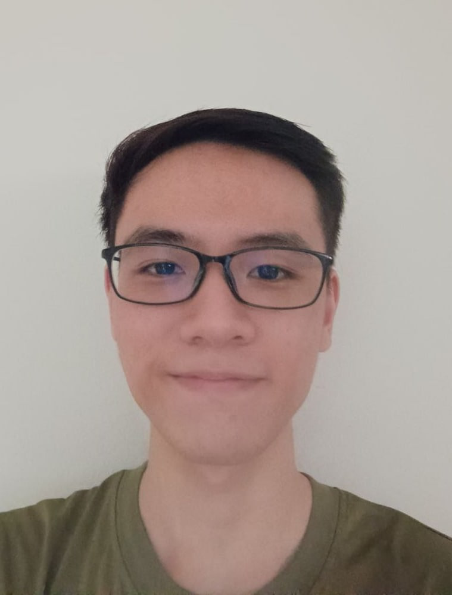
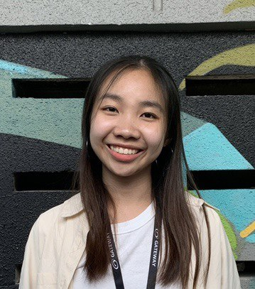
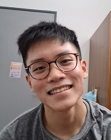

We are a team based in the [School of Computing, National University of Singapore](http://www.comp.nus.edu.sg).

You can reach us at the email `seer[at]comp.nus.edu.sg`

## Project team

### Mok Yao Hui

[[github](http://github.com/laxus2308)]
[[portfolio](team/laxus2308.md)]

* Role: Developer
* Responsibilities:
  * Team Lead, overall project coordination
  * Define, assign and track project tasks
  * Logic Component

### Yong Chang Sheng

[[github](http://github.com/rycs2812)]
[[portfolio](team/rycs2812.md)]

* Role: Developer
* Responsibilities:
  * Code Quality
  * UI Component

### Neo Sun Han

[[github](http://github.com/neosunhan)]
[[portfolio](team/neosunhan.md)]

* Role: Developer
* Responsibilities:
  * Documentation
  * Model Component

### Sng Su May, Rachael

[[github](http://github.com/rachaelsng)]
[[portfolio](team/rachaelsng.md)]

* Role: Developer
* Responsibilities:
  * Testing of the project
  * Storage Component

### Fong Yih Jie

[[github](http://github.com/fongyj)]
[[portfolio](team/fongyj.md)]

* Role: Developer
* Responsibilities:
  * Deliverables and deadlines, Integration
  * Commons Component
