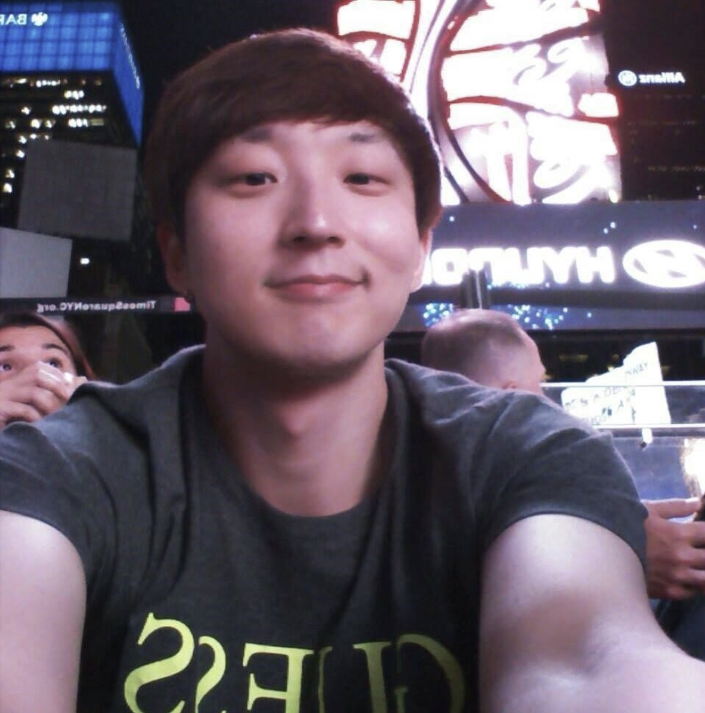
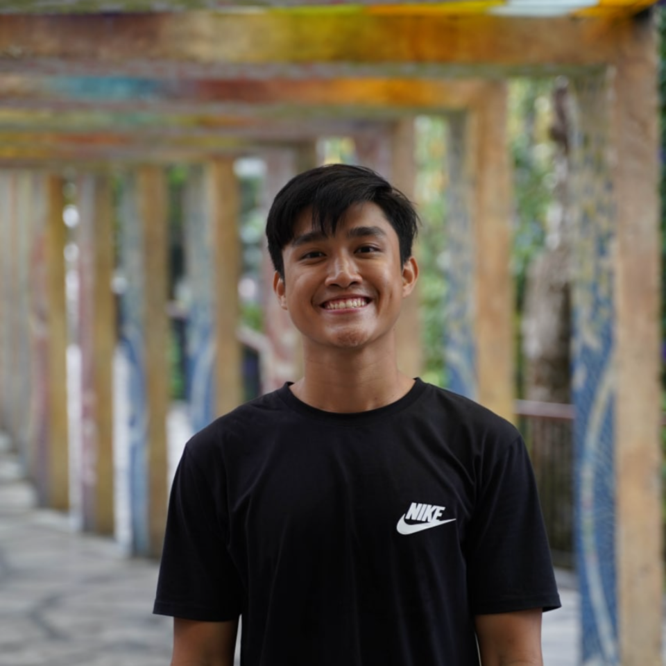
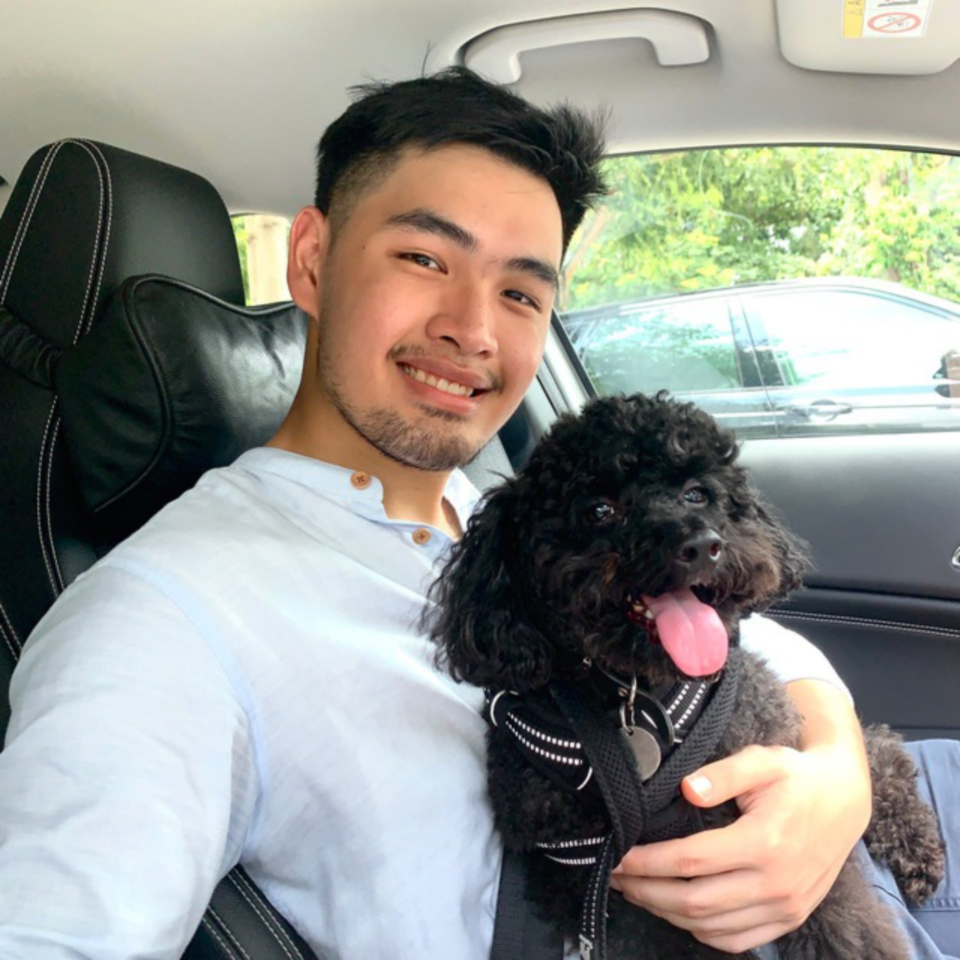
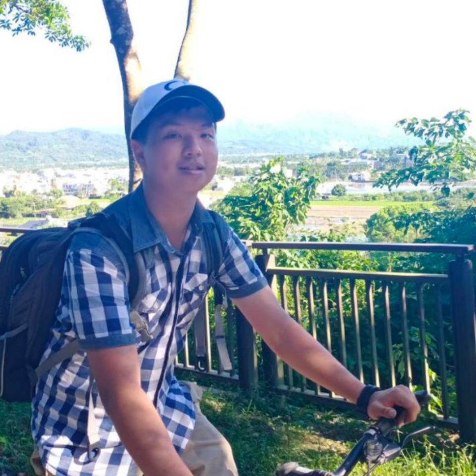
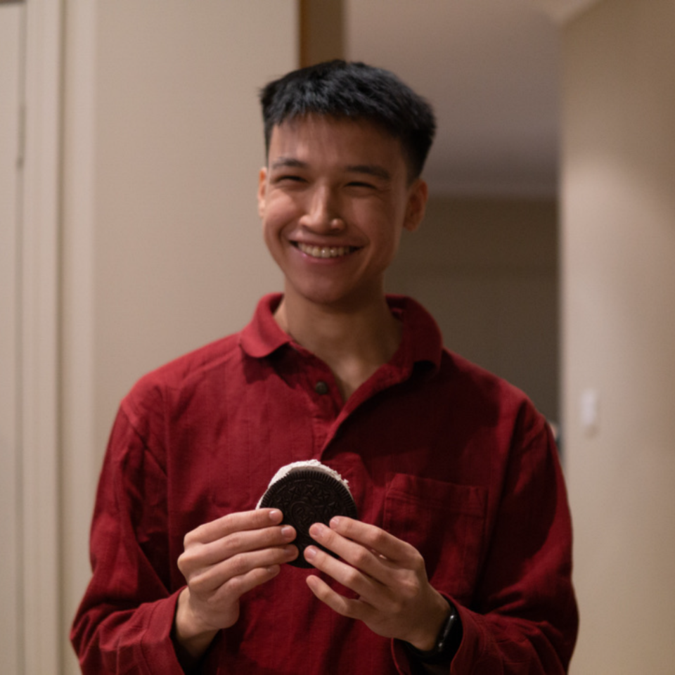
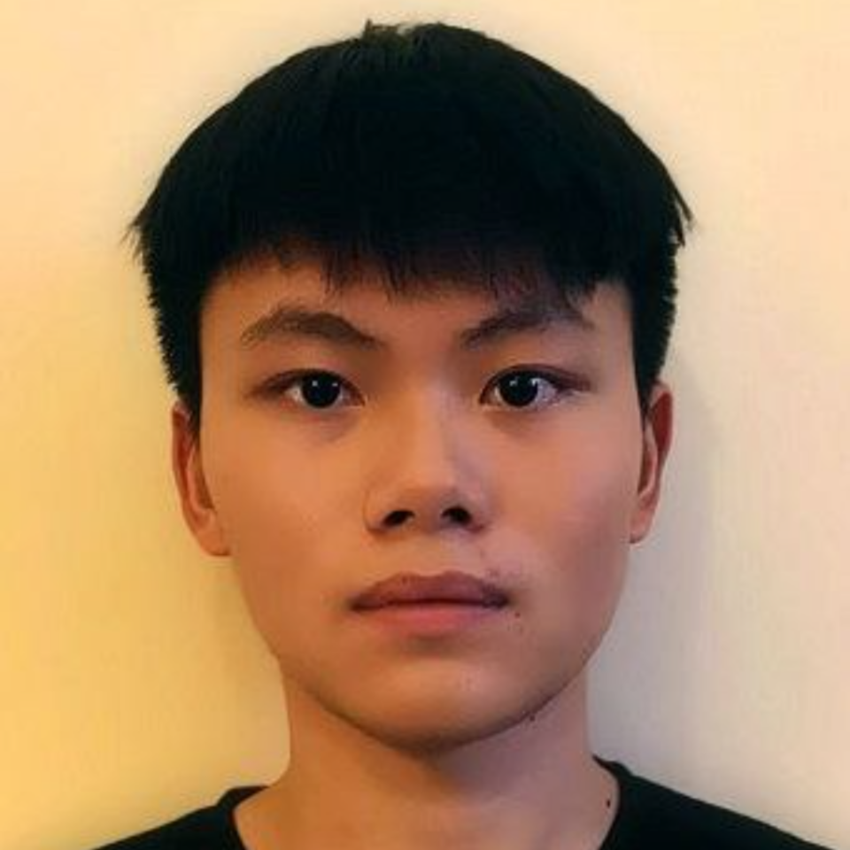

We are a team based in the [School of Computing, National University of Singapore](http://www.comp.nus.edu.sg).

You can reach us at the email `seer[at]comp.nus.edu.sg`

## FABook Team

### Danny (Kim Hyeongcheol)

[github](https://github.com/bluesky0911) |
[portfolio](team/bluesky0911.md)

* Role: Project Advisor, Head Tutor (CS2103T)

### Eugene Tay

[github](https://github.com/eugenetayyj) |
[portfolio](team/eugenetayyj.md)

* Role: Developer
* Responsibilities:
  * Team pull request reviewer

### Shaune Ang

[github](https://github.com/shauneang) |
[portfolio](team/shauneang.md)

* Role: Developer
* Responsibilities:
    * Implement data management

### Liao Yu-Chuan

[github](http://github.com/isanidiot) |
[portfolio](team/isanidiot.md)

* Role: Developer
* Responsibilities: Data

### Peter Fung

[github](http://github.com/fungusta) |
[portfolio](team/fungusta.md)

* Role: Developer
* Responsibilities:
  * Ensuring that deadlines are met

### Reagan Tan

[github](http://github.com/reagantan00) |
[portfolio](team/reagantan00.md)

* Role: Developer
* Responsibilities:
  * [TBC]
