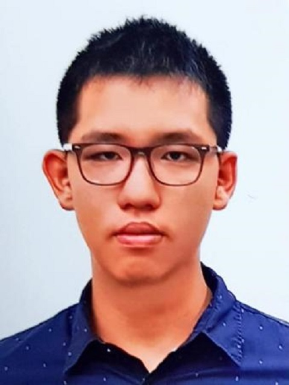
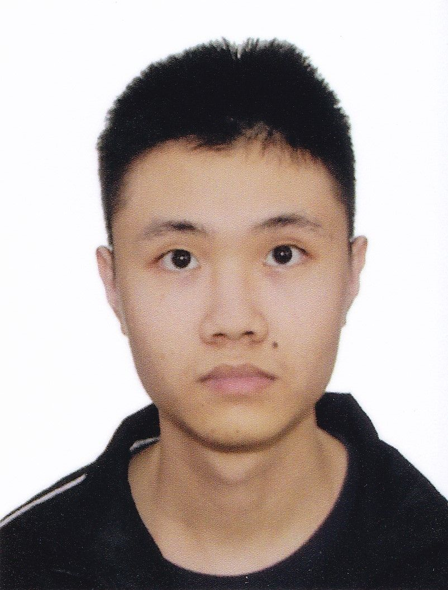
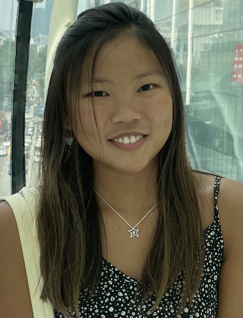
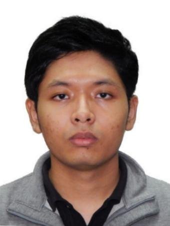

We are a team based in the [School of Computing, National University of Singapore](http://www.comp.nus.edu.sg).

You can reach us at the email `seer[at]comp.nus.edu.sg`

## Project team

### Chan Chung Loong

[[github](https://github.com/hikoya)]
[[portfolio](team/hikoya.md)]

* Role: Deliverables and Scheduling
* Responsibilities: User Interface

### Clarence Chew Xuan Da

[[github](http://github.com/clarence-chew)]
[[portfolio](team/clarence-chew.md)]

* Role: Documentation
* Responsibilities: Storage

### Jamie Tan Wei-Xuan

[[github](http://github.com/jamietan2002)]
[[portfolio](team/jamietan2002.md)]

* Role: Code Quality and Integration
* Responsibilities: Main Logic (Command Parsing)

### Low Lik Hern

[[github](http://github.com/likhern)]
[[portfolio](team/likhern.md)]

* Role: Testing
* Responsibilities: Data

### Min Hein Aung

[[github](http://github.com/minheina)]
[[portfolio](team/minheina.md)]

* Role: Team Lead 
* Responsibilities: Component Logic
