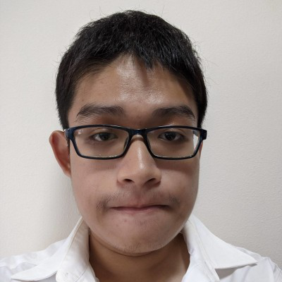
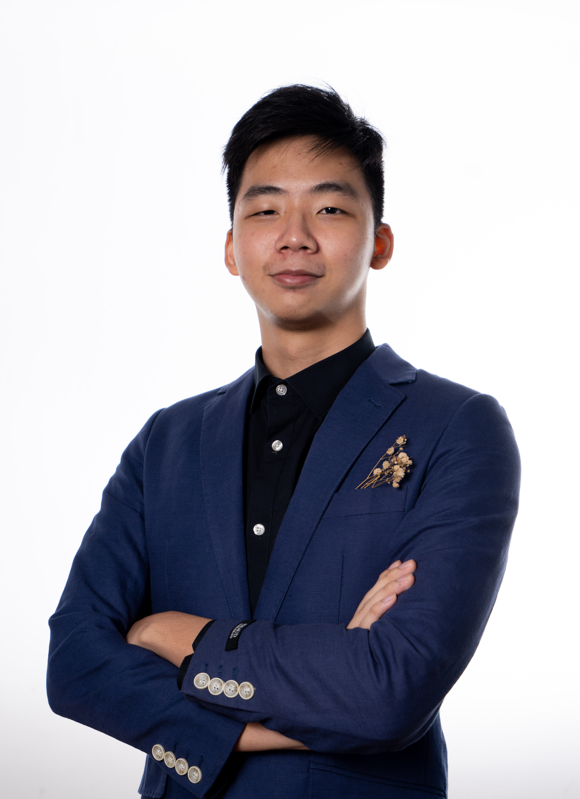
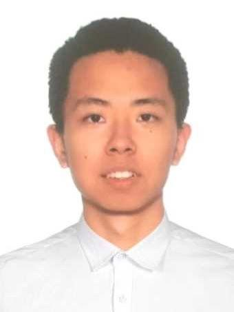
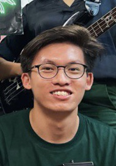
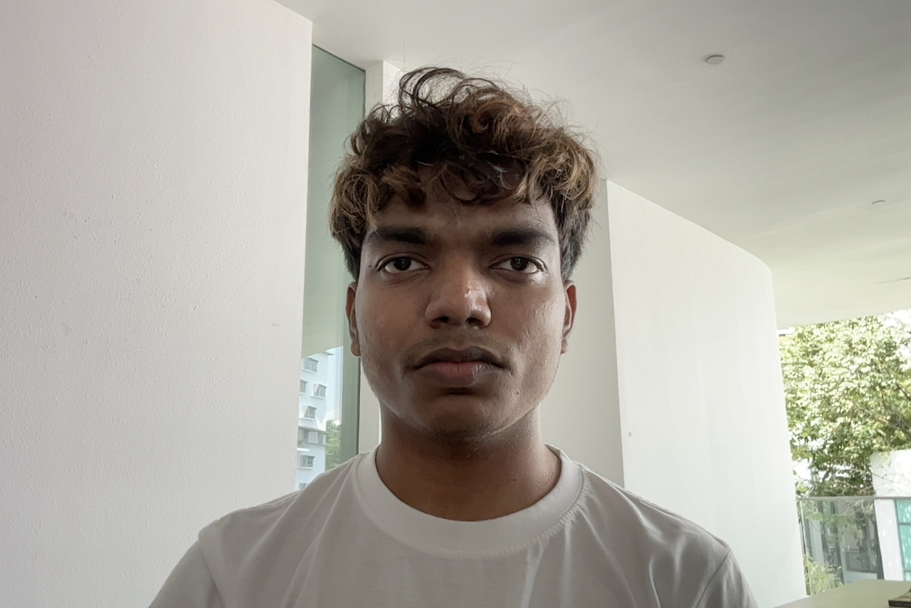

We are a team based in the [School of Computing, National University of Singapore](http://www.comp.nus.edu.sg).

You can reach us at the email `seer[at]comp.nus.edu.sg`

## Project team

### Lim Wei Jun

[[github](http://github.com/limweijun)]
[[portfolio](team/limweijun.md)]

- Role: Developer
- Responsibilities: CI/CD, Testing

### Lam Chun Yu

[[github](http://github.com/gunbux)] [[portfolio](team/gunbux.md)]

- Role: Developer
- Responsibilities: Big Architectural Planning, UML Diagrams

### Lu Yiting

[[github](https://github.com/LuYiting0913)]
[[portfolio](team/luyiting0913.md)]

- Role: Developer
- Responsibilities: User Stories Planning

### Yeo Jun Jie

[[github](http://github.com/yeojunjie)]
[[portfolio](team/yeojunjie.md)]

- Role: Developer
- Responsibilities: UI Specialist

### Bag Devesh Kumar

[[github](https://github.com/tensaida)]
[[portfolio](team/tensaida.md)]

- Role: Developer
- Responsibilities: Command Line Specialist