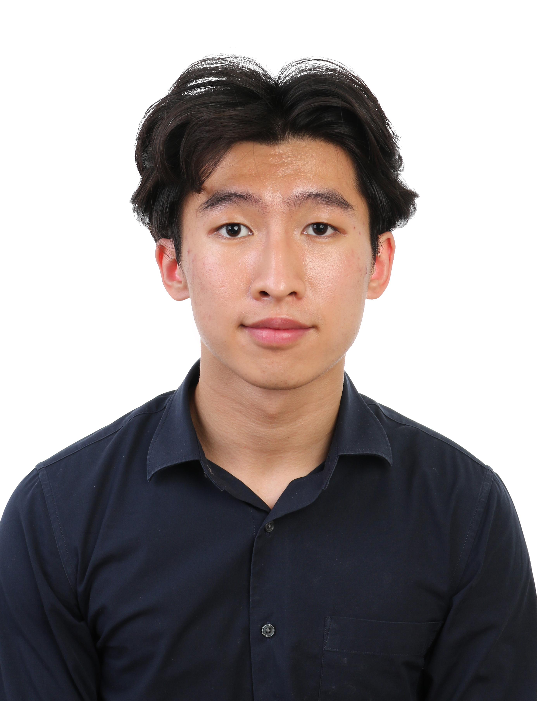
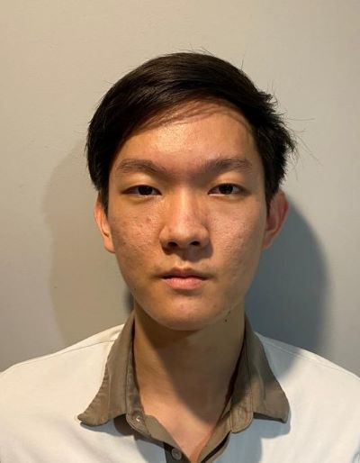
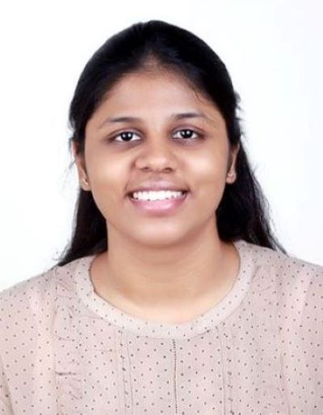
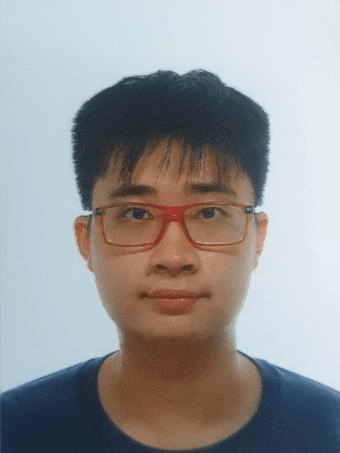

We are a team based in the [School of Computing, National University of Singapore](http://www.comp.nus.edu.sg).

You can reach us at the email `seer[at]comp.nus.edu.sg`

## Project team

### Tai Jun Jie

[[github](https://github.com/TJun-Jie)]
[[portfolio](team/tjun-jie.md)]

* Role: Team Lead, Deliverables and Deadline, Scheduling and Tracking

### Jonathan Wiguna

[[github](http://github.com/JonathanWiguna)]
[[portfolio](team/jonathanwiguna.md)]

* Role: Developer
* Responsibilities: Testing

### Motwani Richa Vijay

[[github](https://github.com/richavm14)]
[[portfolio](team/richavm14.md)]

* Role: Developer
* Responsibilities: Code Quality + Documentation

### Mahesh Anugraha

[[github](http://github.com/anuanas2007)]
[[portfolio](team/anuanas2007.md)]

* Role: Developer
* Responsibilities: Code Quality + Documentation

### Zico

[[github](http://github.com/zicotjia)]
[[portfolio](team/zicotjia.md)]

* Role: Developer
* Responsibilities: Dev Ops + Integration + git expert
